# Arquitectura del Sistema

## 1. Visión General de la Arquitectura

El Sistema de Asistencia Estudiantil utiliza una arquitectura **serverless moderna** basada en **React Server Components** y **Backend-as-a-Service (BaaS)**. Esta arquitectura proporciona escalabilidad automática, alta disponibilidad y costos operativos mínimos.

### Principios Arquitectónicos

1. **Separation of Concerns:** Separación clara entre lógica de presentación, negocio y datos
2. **Progressive Enhancement:** Funcionalidad básica sin JavaScript, mejorada con interactividad
3. **Security by Default:** Seguridad implementada en múltiples capas
4. **API-First Design:** Backend diseñado como API REST consumible
5. **Mobile-First:** Diseño responsivo con prioridad en dispositivos móviles

---

## 2. Diagrama de Arquitectura de Alto Nivel

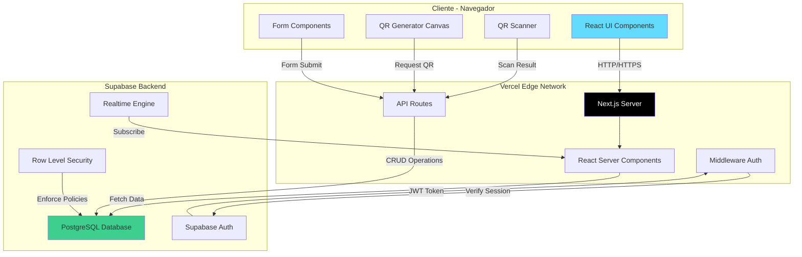

---

## 3. Arquitectura de Capas Detallada

### Capa 1: Presentación (Frontend)

**Tecnología:** React 19 + Next.js 16 App Router

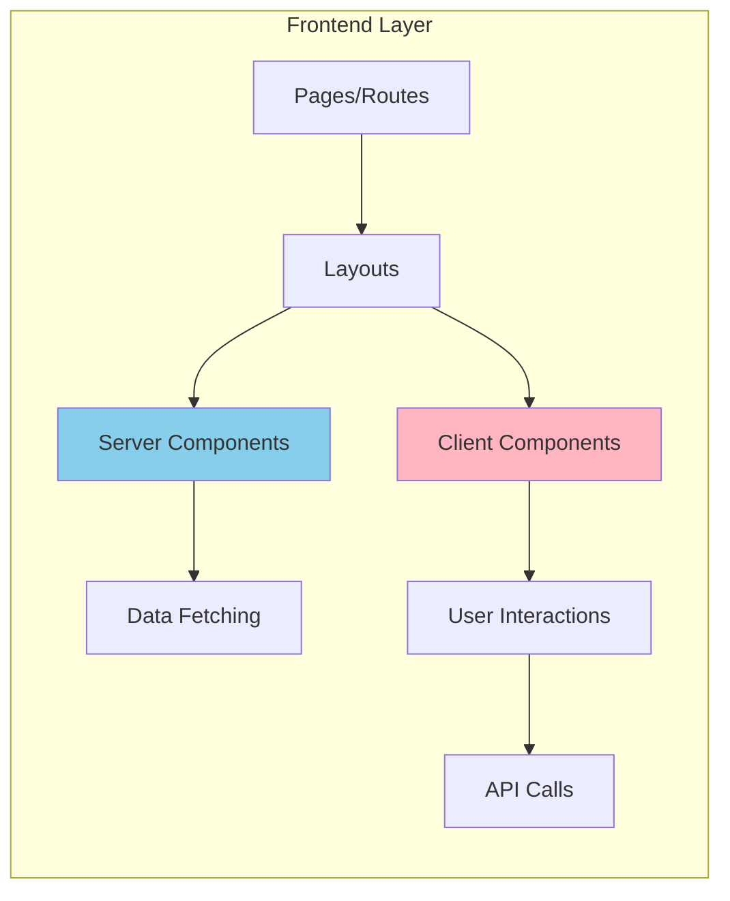

**Componentes:**
- **Páginas (Pages):** Rutas del App Router (`app/**/page.tsx`)
- **Layouts:** Estructuras compartidas con navegación
- **Server Components:** Renderizado en servidor, acceso directo a datos
- **Client Components:** Interactividad del cliente (`'use client'`)
- **Componentes UI:** shadcn/ui components reutilizables

**Responsabilidades:**
- Renderizar interfaz de usuario
- Manejar interacciones del usuario
- Validación de formularios (client-side)
- Escaneo y generación de códigos QR
- Navegación y routing

### Capa 2: Lógica de Negocio (Backend/API)

**Tecnología:** Next.js API Routes + Supabase Client

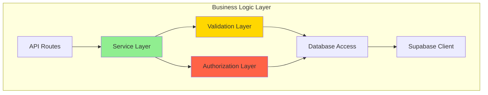

**Componentes:**
- **API Routes:** Endpoints REST (`app/api/**/route.ts`)
- **Services:** Lógica de negocio encapsulada (`lib/services/*.service.ts`)
- **Validations:** Zod schemas para validación de datos
- **Authorization:** Verificación de roles y permisos
- **Supabase Clients:** Cliente browser y servidor

**Responsabilidades:**
- Procesar solicitudes HTTP
- Validar datos de entrada
- Aplicar reglas de negocio
- Gestionar transacciones
- Manejar errores y excepciones

### Capa 3: Datos (Database)

**Tecnología:** PostgreSQL via Supabase

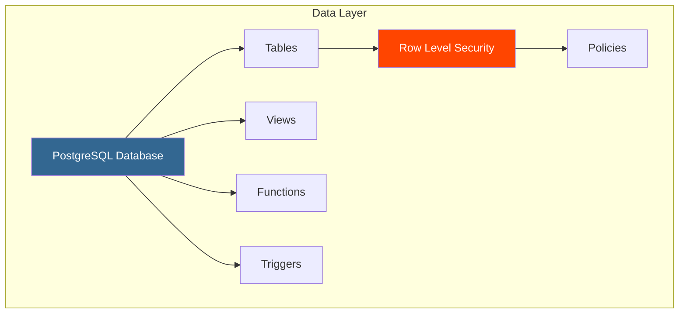

**Componentes:**
- **Tablas:** Almacenamiento estructurado de datos
- **RLS Policies:** Control de acceso a nivel de fila
- **Triggers:** Automatización de lógica (ej. crear perfil)
- **Funciones:** Lógica compleja en PostgreSQL
- **Índices:** Optimización de consultas

**Responsabilidades:**
- Almacenar datos persistentes
- Garantizar integridad referencial
- Aplicar políticas de seguridad
- Optimizar consultas
- Ejecutar lógica en base de datos

---

## 4. Flujo de Datos en la Aplicación

### Flujo de Lectura (Data Fetching)

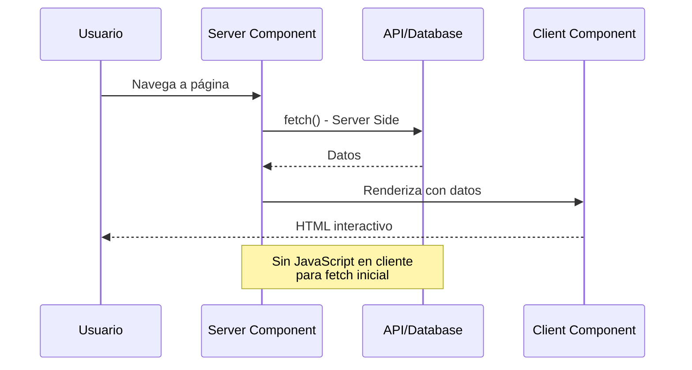

**Características:**
- Fetch en servidor usando `createClient()` de `lib/supabase/server.ts`
- Sin necesidad de estados de carga en cliente
- SEO-friendly (contenido pre-renderizado)
- Menor bundle de JavaScript enviado al cliente

### Flujo de Escritura (Mutations)

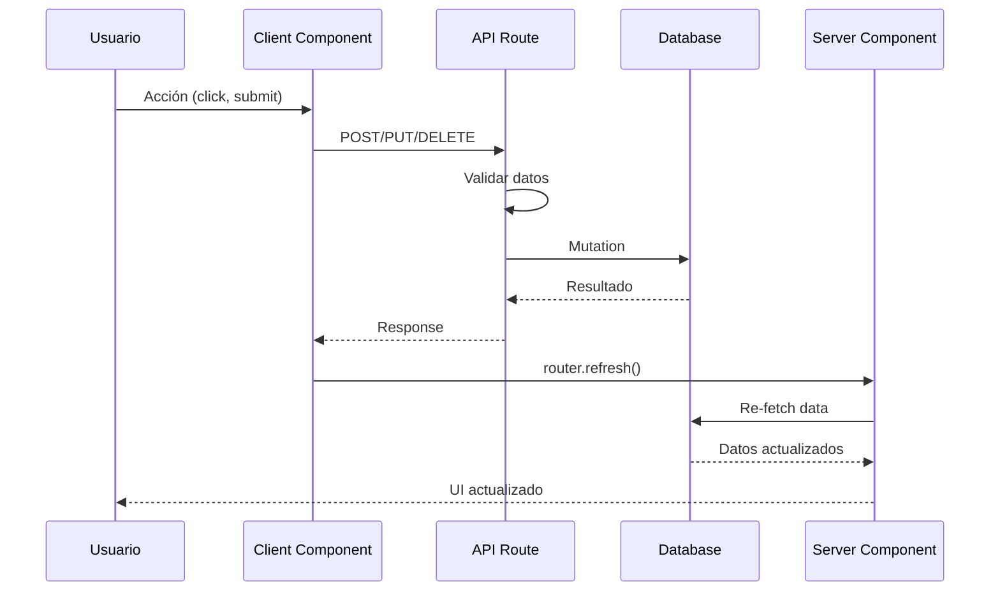

**Características:**
- Mutations via API Routes
- Validación con Zod schemas
- Revalidación automática con `router.refresh()`
- Optimistic updates opcionales

---

## 5. Arquitectura de Autenticación

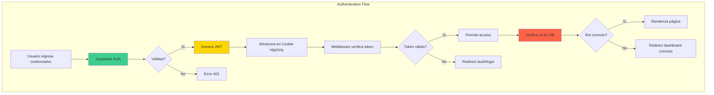

### Componentes de Autenticación

1. **Supabase Auth:**
   - Gestiona usuarios en tabla `auth.users`
   - Genera JWT tokens
   - Maneja verificación de email
   - Refresco automático de tokens

2. **Middleware de Next.js:**
   - Intercepta todas las solicitudes
   - Verifica y refresca sesiones
   - Redirige usuarios no autenticados
   - Ubicación: `middleware.ts`

3. **Layout Guards:**
   - Verifican rol del usuario desde DB
   - Previenen acceso no autorizado
   - Redirigen a dashboard correcto
   - Ubicación: `app/teacher/layout.tsx`, `app/student/layout.tsx`

4. **Row Level Security (RLS):**
   - Políticas a nivel de base de datos
   - Acceso basado en `auth.uid()`
   - Última línea de defensa

---

## 6. Arquitectura de Componentes

### Jerarquía de Componentes

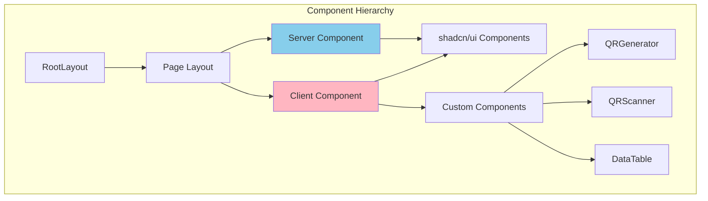

### Tipos de Componentes

#### Server Components (Por Defecto)

```typescript
// app/teacher/page.tsx
export default async function TeacherDashboard() {
  const supabase = await createClient() // Server client
  const { data: subjects } = await supabase.from('subjects').select('*')

  return <SubjectsList subjects={subjects} />
}
```

**Ventajas:**
- Acceso directo a base de datos
- No incrementan bundle de JavaScript
- SEO-friendly
- Mejor rendimiento inicial

**Cuándo usar:**
- Fetching de datos
- Operaciones costosas
- Contenido estático o semi-estático

#### Client Components (`'use client'`)

```typescript
'use client'

// components/qr-scanner-dialog.tsx
export function QRScannerDialog() {
  const [isOpen, setIsOpen] = useState(false)
  const videoRef = useRef<HTMLVideoElement>(null)

  // Lógica de escaneo con hooks
}
```

**Ventajas:**
- Interactividad (onClick, onChange, etc.)
- Hooks de React (useState, useEffect)
- Acceso a APIs del navegador
- Animaciones y transiciones

**Cuándo usar:**
- Formularios interactivos
- Escaneo de QR (acceso a cámara)
- Estados locales
- Event listeners

---

## 7. Arquitectura de Código QR

### Sistema de Generación (Servidor)

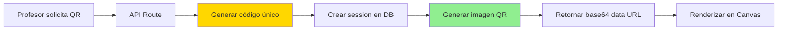

**Proceso:**
1. Formato del código: `{subjectId}-{timestamp}-{random}`
2. Inserción en tabla `attendance_sessions` con `expires_at`
3. Generación de imagen PNG 300x300px
4. Codificación en base64 data URL
5. Envío al cliente para renderizado

### Sistema de Escaneo (Cliente)

```mermaid
graph LR
    A[Estudiante abre scanner] --> B[Solicitar permiso cámara]
    B --> C[Inicializar BrowserMultiFormatReader]
    C --> D[Stream video a elemento HTML]
    D --> E[Detectar código QR]
    E --> F[Enviar código a API]
    F --> G[Validar en servidor]
    G --> H[Registrar asistencia]
    H --> I[Mostrar confirmación]

    style B fill:#FF6347
    style G fill:#FFD700
    style H fill:#90EE90
```

**Validaciones en Servidor:**
1. ✅ Sesión existe en base de datos
2. ✅ Sesión no expirada (`expires_at > now()`)
3. ✅ Estudiante inscrito en la materia
4. ✅ No hay asistencia duplicada para esta sesión

---

## 8. Patrones de Diseño Implementados

### 8.1 Repository Pattern (Implícito)

```typescript
// lib/services/subject.service.ts
export class SubjectService {
  async getSubjectsByTeacher(teacherId: string) {
    const supabase = createClient()
    return await supabase
      .from('subjects')
      .select('*')
      .eq('teacher_id', teacherId)
  }

  async createSubject(data: SubjectInsert) {
    // Lógica de creación
  }
}
```

**Beneficios:**
- Abstracción de acceso a datos
- Reutilización de lógica
- Facilita testing y mocking

### 8.2 Factory Pattern

```typescript
// lib/supabase/client.ts
export function createClient() {
  return createBrowserClient(/* ... */)
}

// lib/supabase/server.ts
export async function createClient() {
  const cookieStore = await cookies()
  return createServerClient(/* ... */)
}
```

**Beneficios:**
- Configuración centralizada
- Clientes específicos por entorno
- Manejo consistente de cookies

### 8.3 Strategy Pattern (RLS Policies)

Diferentes estrategias de acceso según el rol:

```sql
-- Profesores pueden ver/editar sus materias
CREATE POLICY "Teachers manage own subjects"
  ON subjects
  FOR ALL
  TO authenticated
  USING (auth.uid() = teacher_id);

-- Estudiantes pueden ver todas las materias
CREATE POLICY "Students view all subjects"
  ON subjects
  FOR SELECT
  TO authenticated
  USING (
    EXISTS (
      SELECT 1 FROM profiles
      WHERE id = auth.uid() AND role = 'student'
    )
  );
```

### 8.4 Observer Pattern (Realtime)

```typescript
useEffect(() => {
  const channel = supabase
    .channel('attendance_updates')
    .on('postgres_changes',
      { event: 'INSERT', schema: 'public', table: 'attendance_records' },
      (payload) => {
        setRecords(prev => [...prev, payload.new])
      }
    )
    .subscribe()

  return () => supabase.removeChannel(channel)
}, [])
```

**Beneficios:**
- Actualizaciones en tiempo real
- Desacoplamiento de componentes
- Sincronización automática

---

## 9. Seguridad en Capas (Defense in Depth)

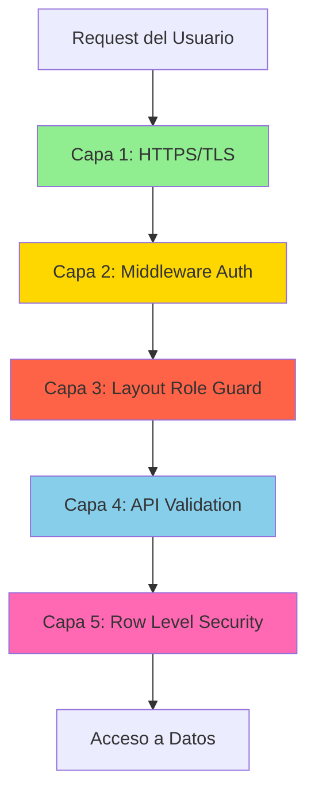

### Capas de Seguridad

1. **Transporte:** HTTPS obligatorio (enforced por Vercel)
2. **Autenticación:** JWT en cookies httpOnly
3. **Autorización de Ruta:** Guards en layouts
4. **Validación de Input:** Zod schemas en API
5. **Acceso a Datos:** RLS policies en PostgreSQL

---

## 10. Escalabilidad y Rendimiento

### Estrategias de Escalabilidad

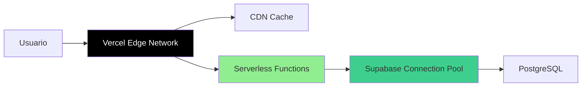

**Características:**

1. **Serverless Auto-scaling:**
   - Funciones se escalan automáticamente
   - Pago solo por uso (no servidores idle)
   - Sin límite de concurrencia

2. **Edge Network:**
   - Contenido estático servido desde CDN
   - Baja latencia global (<50ms)
   - Cache automático de assets

3. **Connection Pooling:**
   - Supabase maneja pool de conexiones
   - Soporte para miles de conexiones concurrentes
   - Reutilización eficiente de conexiones

4. **Database Optimization:**
   - Índices en foreign keys
   - Consultas optimizadas con `.select()` específico
   - RLS con índices para rendimiento

### Optimizaciones de Rendimiento

1. **Code Splitting:**
   - Automático por ruta en Next.js
   - Dynamic imports para componentes pesados
   - Lazy loading de librerías de QR

2. **Server Components:**
   - Reducción de JavaScript enviado al cliente
   - Renderizado en servidor (menor carga en navegador)
   - Streaming de contenido progresivo

3. **Caching:**
   - Cache de assets estáticos (CSS, JS, imágenes)
   - `cache: 'no-store'` para datos dinámicos
   - Revalidación con `router.refresh()`

4. **Database Queries:**
   - `.select('specific,columns')` en lugar de `select('*')`
   - `.limit()` para paginación
   - Índices en campos de búsqueda frecuente

---

## 11. Resiliencia y Manejo de Errores

### Estrategia de Manejo de Errores

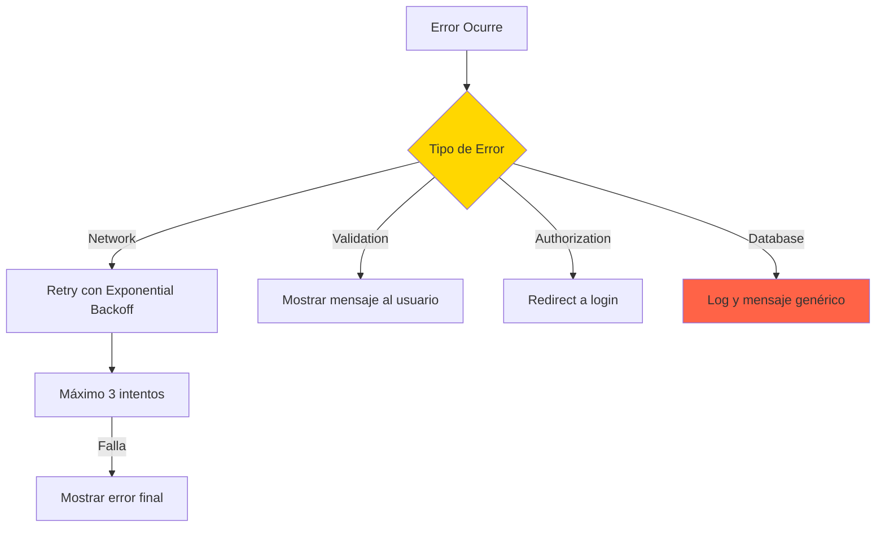

### Patrones de Resiliencia

1. **Graceful Degradation:**
   - Funcionalidad básica sin JavaScript
   - Fallbacks para características avanzadas
   - Mensajes claros de error

2. **Optimistic UI:**
   - Actualizar UI inmediatamente
   - Revertir si mutation falla
   - Mejorar percepción de velocidad

3. **Error Boundaries:**
   - Captura de errores en componentes React
   - Páginas de error personalizadas
   - Logging de errores para debugging

4. **Retry Logic:**
   - Reintentos automáticos para errores transitorios
   - Exponential backoff para evitar sobrecarga
   - Circuit breaker para fallos persistentes

---

## 12. Diagrama de Despliegue

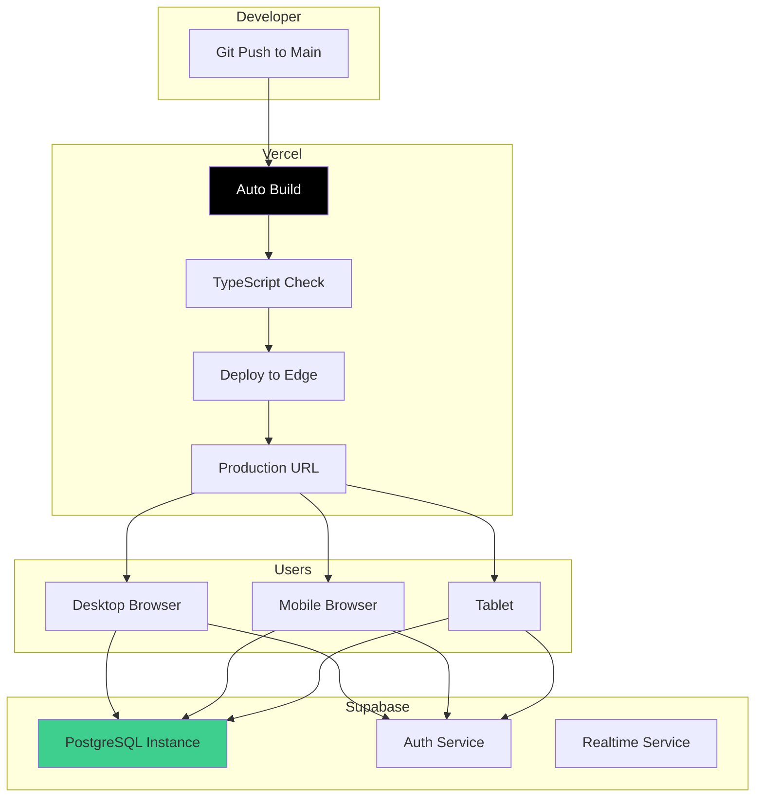

---

## Conclusión

La arquitectura del Sistema de Asistencia Estudiantil ha sido diseñada siguiendo principios modernos de desarrollo web:

- **Modularidad:** Separación clara de responsabilidades
- **Escalabilidad:** Arquitectura serverless que crece automáticamente
- **Seguridad:** Múltiples capas de protección
- **Rendimiento:** Optimizaciones a nivel de framework y base de datos
- **Mantenibilidad:** Código TypeScript tipado y estructurado

Esta arquitectura proporciona una base sólida para el crecimiento futuro del sistema, permitiendo agregar nuevas funcionalidades sin comprometer el rendimiento o la seguridad.

---

[← Resumen Ejecutivo](01-RESUMEN_EJECUTIVO.md) | [Volver al Índice](README.md) | [Siguiente: Stack Tecnológico →](03-TECNOLOGIAS_STACK.md)
