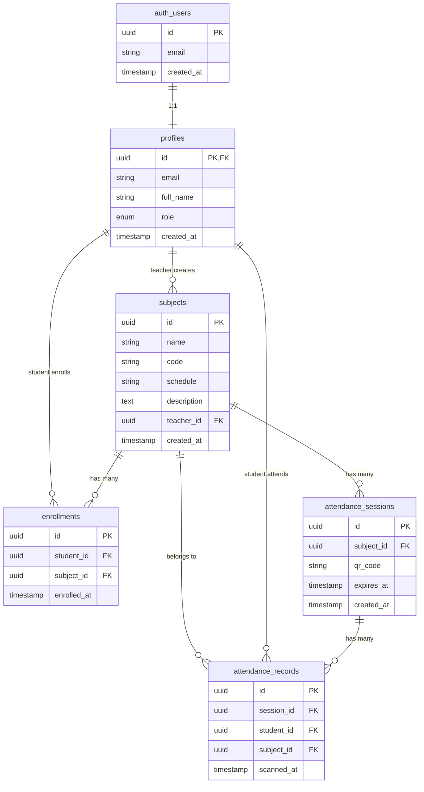
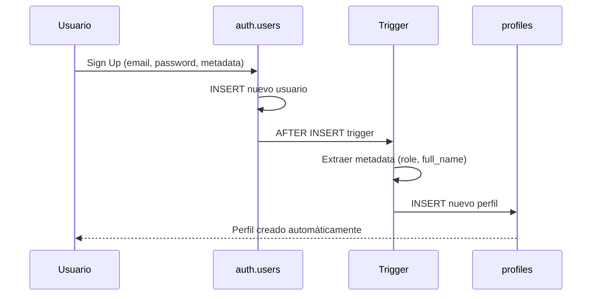
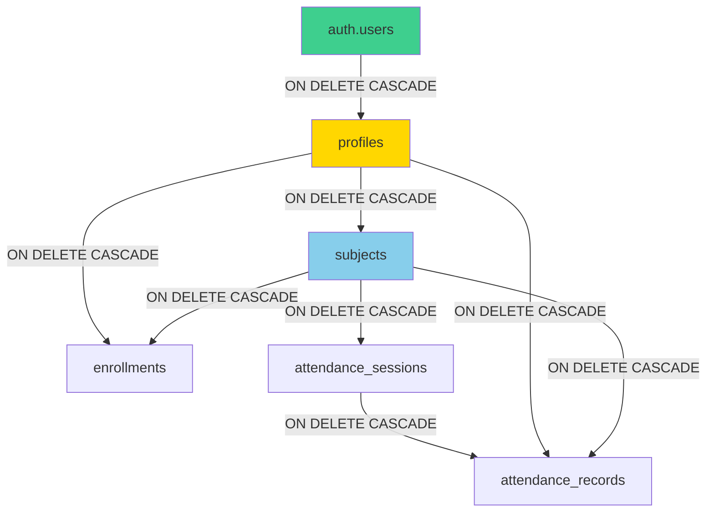

# Base de Datos

## 1. Visión General

El Sistema de Asistencia Estudiantil utiliza **PostgreSQL 15** como sistema de gestión de base de datos relacional, administrado a través de **Supabase**. La arquitectura de datos está diseñada siguiendo principios de normalización, con énfasis en integridad referencial y seguridad a nivel de fila.

### Características Principales

- **Motor:** PostgreSQL 15 (managed by Supabase)
- **Esquema Principal:** `public`
- **Esquema de Autenticación:** `auth` (administrado por Supabase)
- **Número de Tablas:** 5 tablas principales
- **Seguridad:** Row Level Security (RLS) habilitado en todas las tablas
- **Triggers:** 1 trigger para creación automática de perfiles

---

## 2. Diagrama Entidad-Relación (ERD)



---

## 3. Tablas Detalladas

### 3.1 Tabla: `profiles`

**Propósito:** Almacena información extendida de usuarios (profesores y estudiantes)

**Relación con `auth.users`:** 1:1 (extensión del usuario de autenticación)

```sql
CREATE TABLE public.profiles (
  id UUID PRIMARY KEY REFERENCES auth.users(id) ON DELETE CASCADE,
  email TEXT NOT NULL,
  full_name TEXT,
  role TEXT NOT NULL CHECK (role IN ('teacher', 'student')),
  created_at TIMESTAMPTZ NOT NULL DEFAULT now()
);

-- Índices
CREATE INDEX idx_profiles_role ON profiles(role);
CREATE INDEX idx_profiles_email ON profiles(email);
```

#### Estructura de Campos

| Campo | Tipo | Constraints | Descripción |
|-------|------|-------------|-------------|
| `id` | UUID | PRIMARY KEY, FK → auth.users | Identificador único del usuario |
| `email` | TEXT | NOT NULL | Correo electrónico del usuario |
| `full_name` | TEXT | NULL | Nombre completo del usuario |
| `role` | TEXT | NOT NULL, CHECK | Rol: 'teacher' o 'student' |
| `created_at` | TIMESTAMPTZ | NOT NULL, DEFAULT now() | Fecha de creación del perfil |

#### Ejemplo de Datos

```json
{
  "id": "a1b2c3d4-e5f6-7890-abcd-ef1234567890",
  "email": "profesor@universidad.edu",
  "full_name": "Dr. Juan Pérez",
  "role": "teacher",
  "created_at": "2024-11-13T10:00:00Z"
}
```

---

### 3.2 Tabla: `subjects`

**Propósito:** Almacena las materias o asignaturas creadas por profesores

```sql
CREATE TABLE public.subjects (
  id UUID PRIMARY KEY DEFAULT gen_random_uuid(),
  name TEXT NOT NULL,
  code TEXT NOT NULL,
  schedule TEXT,
  description TEXT,
  teacher_id UUID NOT NULL REFERENCES profiles(id) ON DELETE CASCADE,
  created_at TIMESTAMPTZ NOT NULL DEFAULT now()
);

-- Índices
CREATE INDEX idx_subjects_teacher ON subjects(teacher_id);
CREATE INDEX idx_subjects_code ON subjects(code);
```

#### Estructura de Campos

| Campo | Tipo | Constraints | Descripción |
|-------|------|-------------|-------------|
| `id` | UUID | PRIMARY KEY, DEFAULT | Identificador único de la materia |
| `name` | TEXT | NOT NULL | Nombre de la materia |
| `code` | TEXT | NOT NULL | Código de la materia (ej: "MAT101") |
| `schedule` | TEXT | NULL | Horario de la materia |
| `description` | TEXT | NULL | Descripción de la materia |
| `teacher_id` | UUID | NOT NULL, FK → profiles | Profesor que imparte la materia |
| `created_at` | TIMESTAMPTZ | NOT NULL, DEFAULT now() | Fecha de creación |

#### Ejemplo de Datos

```json
{
  "id": "b2c3d4e5-f6g7-8901-bcde-f12345678901",
  "name": "Matemáticas Discretas",
  "code": "MAT101",
  "schedule": "Lunes y Miércoles 10:00-12:00",
  "description": "Introducción a la lógica matemática y teoría de conjuntos",
  "teacher_id": "a1b2c3d4-e5f6-7890-abcd-ef1234567890",
  "created_at": "2024-11-13T10:00:00Z"
}
```

#### Constraints de Negocio

- Un profesor puede tener múltiples materias
- Una materia pertenece a un solo profesor
- Si se elimina un profesor, se eliminan sus materias (CASCADE)

---

### 3.3 Tabla: `enrollments`

**Propósito:** Relación muchos-a-muchos entre estudiantes y materias

```sql
CREATE TABLE public.enrollments (
  id UUID PRIMARY KEY DEFAULT gen_random_uuid(),
  student_id UUID NOT NULL REFERENCES profiles(id) ON DELETE CASCADE,
  subject_id UUID NOT NULL REFERENCES subjects(id) ON DELETE CASCADE,
  enrolled_at TIMESTAMPTZ NOT NULL DEFAULT now(),
  UNIQUE(student_id, subject_id)
);

-- Índices
CREATE INDEX idx_enrollments_student ON enrollments(student_id);
CREATE INDEX idx_enrollments_subject ON enrollments(subject_id);
CREATE UNIQUE INDEX idx_enrollments_unique ON enrollments(student_id, subject_id);
```

#### Estructura de Campos

| Campo | Tipo | Constraints | Descripción |
|-------|------|-------------|-------------|
| `id` | UUID | PRIMARY KEY, DEFAULT | Identificador único de la inscripción |
| `student_id` | UUID | NOT NULL, FK → profiles | Estudiante inscrito |
| `subject_id` | UUID | NOT NULL, FK → subjects | Materia inscrita |
| `enrolled_at` | TIMESTAMPTZ | NOT NULL, DEFAULT now() | Fecha de inscripción |

#### Constraint UNIQUE

```sql
UNIQUE(student_id, subject_id)
```

**Propósito:** Garantizar que un estudiante no se inscriba dos veces en la misma materia

#### Ejemplo de Datos

```json
{
  "id": "c3d4e5f6-g7h8-9012-cdef-g23456789012",
  "student_id": "d4e5f6g7-h8i9-0123-defg-h34567890123",
  "subject_id": "b2c3d4e5-f6g7-8901-bcde-f12345678901",
  "enrolled_at": "2024-11-13T10:30:00Z"
}
```

---

### 3.4 Tabla: `attendance_sessions`

**Propósito:** Almacena sesiones de códigos QR con tiempo de expiración

```sql
CREATE TABLE public.attendance_sessions (
  id UUID PRIMARY KEY DEFAULT gen_random_uuid(),
  subject_id UUID NOT NULL REFERENCES subjects(id) ON DELETE CASCADE,
  qr_code TEXT NOT NULL UNIQUE,
  expires_at TIMESTAMPTZ NOT NULL,
  created_at TIMESTAMPTZ NOT NULL DEFAULT now()
);

-- Índices
CREATE INDEX idx_sessions_subject ON attendance_sessions(subject_id);
CREATE UNIQUE INDEX idx_sessions_qr_code ON attendance_sessions(qr_code);
CREATE INDEX idx_sessions_expires ON attendance_sessions(expires_at);
```

#### Estructura de Campos

| Campo | Tipo | Constraints | Descripción |
|-------|------|-------------|-------------|
| `id` | UUID | PRIMARY KEY, DEFAULT | Identificador único de la sesión |
| `subject_id` | UUID | NOT NULL, FK → subjects | Materia asociada |
| `qr_code` | TEXT | NOT NULL, UNIQUE | Código QR único |
| `expires_at` | TIMESTAMPTZ | NOT NULL | Fecha/hora de expiración |
| `created_at` | TIMESTAMPTZ | NOT NULL, DEFAULT now() | Fecha de creación |

#### Formato del QR Code

```typescript
// Formato: {subjectId}-{timestamp}-{random}
const qrCode = `${subjectId}-${Date.now()}-${Math.random().toString(36).substring(7)}`

// Ejemplo:
// "b2c3d4e5-f6g7-8901-bcde-f12345678901-1699876543210-x7k2m9p"
```

#### Ejemplo de Datos

```json
{
  "id": "e5f6g7h8-i9j0-1234-efgh-i45678901234",
  "subject_id": "b2c3d4e5-f6g7-8901-bcde-f12345678901",
  "qr_code": "b2c3d4e5-f6g7-8901-bcde-f12345678901-1699876543210-x7k2m9p",
  "expires_at": "2024-11-13T11:00:00Z",
  "created_at": "2024-11-13T10:30:00Z"
}
```

#### Lógica de Expiración

```sql
-- Sesiones activas (no expiradas)
SELECT * FROM attendance_sessions
WHERE expires_at > now();

-- Sesiones expiradas
SELECT * FROM attendance_sessions
WHERE expires_at <= now();
```

---

### 3.5 Tabla: `attendance_records`

**Propósito:** Registros individuales de asistencia de estudiantes

```sql
CREATE TABLE public.attendance_records (
  id UUID PRIMARY KEY DEFAULT gen_random_uuid(),
  session_id UUID NOT NULL REFERENCES attendance_sessions(id) ON DELETE CASCADE,
  student_id UUID NOT NULL REFERENCES profiles(id) ON DELETE CASCADE,
  subject_id UUID NOT NULL REFERENCES subjects(id) ON DELETE CASCADE,
  scanned_at TIMESTAMPTZ NOT NULL DEFAULT now(),
  UNIQUE(session_id, student_id)
);

-- Índices
CREATE INDEX idx_records_session ON attendance_records(session_id);
CREATE INDEX idx_records_student ON attendance_records(student_id);
CREATE INDEX idx_records_subject ON attendance_records(subject_id);
CREATE INDEX idx_records_scanned_at ON attendance_records(scanned_at);
CREATE UNIQUE INDEX idx_records_unique ON attendance_records(session_id, student_id);
```

#### Estructura de Campos

| Campo | Tipo | Constraints | Descripción |
|-------|------|-------------|-------------|
| `id` | UUID | PRIMARY KEY, DEFAULT | Identificador único del registro |
| `session_id` | UUID | NOT NULL, FK → attendance_sessions | Sesión de asistencia |
| `student_id` | UUID | NOT NULL, FK → profiles | Estudiante que asistió |
| `subject_id` | UUID | NOT NULL, FK → subjects | Materia (denormalizado) |
| `scanned_at` | TIMESTAMPTZ | NOT NULL, DEFAULT now() | Fecha/hora del escaneo |

#### Constraint UNIQUE

```sql
UNIQUE(session_id, student_id)
```

**Propósito:** Evitar que un estudiante registre asistencia múltiples veces en la misma sesión

#### Denormalización: `subject_id`

**¿Por qué?**
- Optimización de queries: Evita JOIN con `attendance_sessions`
- Reportes más rápidos: Filtrar directamente por materia
- Histórico: Si la sesión se elimina, mantiene referencia a la materia

#### Ejemplo de Datos

```json
{
  "id": "f6g7h8i9-j0k1-2345-fghi-j56789012345",
  "session_id": "e5f6g7h8-i9j0-1234-efgh-i45678901234",
  "student_id": "d4e5f6g7-h8i9-0123-defg-h34567890123",
  "subject_id": "b2c3d4e5-f6g7-8901-bcde-f12345678901",
  "scanned_at": "2024-11-13T10:35:00Z"
}
```

---

## 4. Row Level Security (RLS)

### 4.1 ¿Qué es RLS?

Row Level Security (Seguridad a Nivel de Fila) es una característica de PostgreSQL que permite definir **políticas de acceso** a nivel de fila de datos. Cada consulta SQL se ejecuta en el contexto del usuario autenticado, y las políticas determinan qué filas puede ver o modificar.

### 4.2 Ventajas de RLS

1. **Seguridad a nivel de base de datos:** No depende solo del código de aplicación
2. **Prevención de ataques:** Protege contra inyección SQL y acceso no autorizado
3. **Simplicidad:** Reglas centralizadas en la base de datos
4. **Auditoría:** Todas las operaciones son verificadas por el motor de BD

### 4.3 Contexto de Usuario en Supabase

```sql
-- Obtener el ID del usuario autenticado
auth.uid()

-- Obtener el JWT del usuario
auth.jwt()

-- Verificar si el usuario está autenticado
auth.role()
```

---

## 5. Políticas RLS por Tabla

### 5.1 Políticas de `profiles`

#### Política 1: Crear Propio Perfil

```sql
CREATE POLICY "Users can insert their own profile"
  ON profiles
  FOR INSERT
  TO authenticated
  WITH CHECK (auth.uid() = id);
```

**Propósito:** Permitir que los usuarios creen su propio perfil durante el registro

#### Política 2: Ver Propio Perfil

```sql
CREATE POLICY "Users can view their own profile"
  ON profiles
  FOR SELECT
  TO authenticated
  USING (auth.uid() = id);
```

**Propósito:** Los usuarios solo pueden ver su propia información de perfil

#### Política 3: Actualizar Propio Perfil

```sql
CREATE POLICY "Users can update their own profile"
  ON profiles
  FOR UPDATE
  TO authenticated
  USING (auth.uid() = id)
  WITH CHECK (auth.uid() = id);
```

**Propósito:** Los usuarios pueden actualizar solo su propio perfil

---

### 5.2 Políticas de `subjects`

#### Política 1: Profesores Crean Materias

```sql
CREATE POLICY "Teachers can create subjects"
  ON subjects
  FOR INSERT
  TO authenticated
  WITH CHECK (
    auth.uid() = teacher_id AND
    EXISTS (
      SELECT 1 FROM profiles
      WHERE id = auth.uid() AND role = 'teacher'
    )
  );
```

**Propósito:** Solo profesores pueden crear materias, y deben asignarse a sí mismos

#### Política 2: Profesores Gestionan Sus Materias

```sql
CREATE POLICY "Teachers manage their own subjects"
  ON subjects
  FOR ALL
  TO authenticated
  USING (auth.uid() = teacher_id)
  WITH CHECK (auth.uid() = teacher_id);
```

**Propósito:** Los profesores pueden ver, actualizar y eliminar solo sus propias materias

#### Política 3: Todos Ven Todas las Materias

```sql
CREATE POLICY "Everyone can view all subjects"
  ON subjects
  FOR SELECT
  TO authenticated
  USING (true);
```

**Propósito:** Todos los usuarios autenticados pueden ver todas las materias (necesario para inscripción de estudiantes)

---

### 5.3 Políticas de `enrollments`

#### Política 1: Estudiantes Se Inscriben

```sql
CREATE POLICY "Students can enroll themselves"
  ON enrollments
  FOR INSERT
  TO authenticated
  WITH CHECK (
    auth.uid() = student_id AND
    EXISTS (
      SELECT 1 FROM profiles
      WHERE id = auth.uid() AND role = 'student'
    )
  );
```

**Propósito:** Los estudiantes pueden inscribirse a sí mismos en materias

#### Política 2: Profesores Gestionan Inscripciones

```sql
CREATE POLICY "Teachers manage enrollments for their subjects"
  ON enrollments
  FOR ALL
  TO authenticated
  USING (
    EXISTS (
      SELECT 1 FROM subjects
      WHERE id = enrollments.subject_id
        AND teacher_id = auth.uid()
    )
  );
```

**Propósito:** Los profesores pueden ver y gestionar inscripciones de sus materias

#### Política 3: Estudiantes Ven Sus Inscripciones

```sql
CREATE POLICY "Students view their own enrollments"
  ON enrollments
  FOR SELECT
  TO authenticated
  USING (auth.uid() = student_id);
```

**Propósito:** Los estudiantes pueden ver sus propias inscripciones

---

### 5.4 Políticas de `attendance_sessions`

#### Política 1: Profesores Crean Sesiones

```sql
CREATE POLICY "Teachers create sessions for their subjects"
  ON attendance_sessions
  FOR INSERT
  TO authenticated
  WITH CHECK (
    EXISTS (
      SELECT 1 FROM subjects
      WHERE id = attendance_sessions.subject_id
        AND teacher_id = auth.uid()
    )
  );
```

**Propósito:** Solo profesores pueden crear sesiones para sus propias materias

#### Política 2: Profesores Gestionan Sus Sesiones

```sql
CREATE POLICY "Teachers manage their own sessions"
  ON attendance_sessions
  FOR ALL
  TO authenticated
  USING (
    EXISTS (
      SELECT 1 FROM subjects
      WHERE id = attendance_sessions.subject_id
        AND teacher_id = auth.uid()
    )
  );
```

**Propósito:** Los profesores pueden ver, actualizar y eliminar sesiones de sus materias

#### Política 3: Estudiantes Ven Sesiones Activas

```sql
CREATE POLICY "Students view active sessions"
  ON attendance_sessions
  FOR SELECT
  TO authenticated
  USING (
    expires_at > now() AND
    EXISTS (
      SELECT 1 FROM profiles
      WHERE id = auth.uid() AND role = 'student'
    )
  );
```

**Propósito:** Los estudiantes solo ven sesiones no expiradas

---

### 5.5 Políticas de `attendance_records`

#### Política 1: Estudiantes Registran Su Asistencia

```sql
CREATE POLICY "Students can record their own attendance"
  ON attendance_records
  FOR INSERT
  TO authenticated
  WITH CHECK (
    auth.uid() = student_id AND
    EXISTS (
      SELECT 1 FROM enrollments
      WHERE student_id = auth.uid()
        AND subject_id = attendance_records.subject_id
    ) AND
    EXISTS (
      SELECT 1 FROM attendance_sessions
      WHERE id = attendance_records.session_id
        AND expires_at > now()
    )
  );
```

**Propósito:** Los estudiantes pueden registrar su propia asistencia si:
- Están inscritos en la materia
- La sesión no ha expirado

#### Política 2: Profesores Ven Asistencia de Sus Materias

```sql
CREATE POLICY "Teachers view attendance for their subjects"
  ON attendance_records
  FOR SELECT
  TO authenticated
  USING (
    EXISTS (
      SELECT 1 FROM subjects
      WHERE id = attendance_records.subject_id
        AND teacher_id = auth.uid()
    )
  );
```

**Propósito:** Los profesores ven todos los registros de asistencia de sus materias

#### Política 3: Estudiantes Ven Su Propia Asistencia

```sql
CREATE POLICY "Students view their own attendance"
  ON attendance_records
  FOR SELECT
  TO authenticated
  USING (auth.uid() = student_id);
```

**Propósito:** Los estudiantes ven solo sus propios registros de asistencia

---

## 6. Triggers y Funciones

### 6.1 Trigger: Creación Automática de Perfil

**Propósito:** Crear automáticamente un perfil en `profiles` cuando se crea un usuario en `auth.users`

#### Función

```sql
CREATE OR REPLACE FUNCTION public.handle_new_user()
RETURNS TRIGGER
LANGUAGE plpgsql
SECURITY DEFINER
AS $$
BEGIN
  INSERT INTO public.profiles (id, email, full_name, role)
  VALUES (
    NEW.id,
    NEW.email,
    COALESCE(NEW.raw_user_meta_data->>'full_name', ''),
    COALESCE(NEW.raw_user_meta_data->>'role', 'student')
  );
  RETURN NEW;
END;
$$;
```

#### Trigger

```sql
CREATE TRIGGER on_auth_user_created
  AFTER INSERT ON auth.users
  FOR EACH ROW
  EXECUTE FUNCTION public.handle_new_user();
```

#### Flujo



---

## 7. Índices y Optimización

### 7.1 Índices Implementados

| Tabla | Índice | Campos | Propósito |
|-------|--------|--------|-----------|
| `profiles` | `idx_profiles_role` | `role` | Filtrar por rol |
| `profiles` | `idx_profiles_email` | `email` | Búsqueda por email |
| `subjects` | `idx_subjects_teacher` | `teacher_id` | Materias de un profesor |
| `subjects` | `idx_subjects_code` | `code` | Búsqueda por código |
| `enrollments` | `idx_enrollments_student` | `student_id` | Inscripciones de un estudiante |
| `enrollments` | `idx_enrollments_subject` | `subject_id` | Estudiantes de una materia |
| `enrollments` | `idx_enrollments_unique` | `student_id, subject_id` | Prevenir duplicados |
| `attendance_sessions` | `idx_sessions_subject` | `subject_id` | Sesiones de una materia |
| `attendance_sessions` | `idx_sessions_qr_code` | `qr_code` | Búsqueda por código QR |
| `attendance_sessions` | `idx_sessions_expires` | `expires_at` | Filtrar expiradas |
| `attendance_records` | `idx_records_session` | `session_id` | Registros de una sesión |
| `attendance_records` | `idx_records_student` | `student_id` | Asistencias de un estudiante |
| `attendance_records` | `idx_records_subject` | `subject_id` | Asistencias de una materia |
| `attendance_records` | `idx_records_scanned_at` | `scanned_at` | Ordenar por fecha |

### 7.2 Consultas Optimizadas

#### Query 1: Materias de un Profesor con Conteo de Estudiantes

```sql
SELECT
  s.*,
  COUNT(DISTINCT e.student_id) as student_count
FROM subjects s
LEFT JOIN enrollments e ON s.id = e.subject_id
WHERE s.teacher_id = 'teacher-uuid'
GROUP BY s.id
ORDER BY s.created_at DESC;
```

**Índices Usados:**
- `idx_subjects_teacher` (WHERE)
- `idx_enrollments_subject` (JOIN)

#### Query 2: Asistencia de Estudiantes en una Materia

```sql
SELECT
  p.full_name,
  p.email,
  ar.scanned_at
FROM attendance_records ar
JOIN profiles p ON ar.student_id = p.id
WHERE ar.subject_id = 'subject-uuid'
  AND ar.scanned_at BETWEEN '2024-11-01' AND '2024-11-30'
ORDER BY ar.scanned_at DESC;
```

**Índices Usados:**
- `idx_records_subject` (WHERE)
- `idx_records_scanned_at` (filtro de fecha y ORDER BY)

#### Query 3: Validar Código QR

```sql
SELECT
  ase.id,
  ase.subject_id,
  ase.expires_at,
  EXISTS (
    SELECT 1 FROM enrollments
    WHERE student_id = 'student-uuid'
      AND subject_id = ase.subject_id
  ) as is_enrolled
FROM attendance_sessions ase
WHERE ase.qr_code = 'qr-code-string'
  AND ase.expires_at > now();
```

**Índices Usados:**
- `idx_sessions_qr_code` (WHERE único)
- `idx_sessions_expires` (filtro de expiración)
- `idx_enrollments_student` y `idx_enrollments_subject` (EXISTS subquery)

---

## 8. Migraciones

### Orden de Aplicación

1. **001_initial_schema.sql:** Crear tablas básicas y RLS inicial
2. **002_create_profile_trigger.sql:** Trigger de creación automática de perfiles
3. **003_update_sessions_policy.sql:** Mejorar mensajes de error en políticas
4. **004_enable_student_enrollment.sql:** Permitir auto-inscripción de estudiantes
5. **005_fix_profiles_policy.sql:** Corregir políticas de profiles
6. **006_allow_public_subject_viewing.sql:** Permitir ver materias a todos

### Aplicación Manual

Todas las migraciones se aplican manualmente en Supabase SQL Editor:

1. Ir a: https://supabase.com/dashboard/project/elthoicbggstbrjsxuog/sql
2. Copiar contenido de `supabase/APPLY_ALL_MIGRATIONS.sql`
3. Ejecutar SQL

---

## 9. Integridad Referencial



**Cascadas Implementadas:**

- Si se elimina un usuario de `auth.users`, se elimina su perfil
- Si se elimina un perfil de profesor, se eliminan sus materias
- Si se elimina una materia, se eliminan inscripciones, sesiones y registros
- Si se elimina una sesión, se eliminan sus registros de asistencia

---

## 10. Backup y Recuperación

### Backup Automático (Supabase)

- **Frecuencia:** Diaria
- **Retención:** 7 días (plan gratuito)
- **Tipo:** Full database backup
- **Ubicación:** Infraestructura de Supabase (AWS)

### Backup Manual

```bash
# Usando pg_dump (requiere acceso directo a PostgreSQL)
pg_dump -h db.elthoicbggstbrjsxuog.supabase.co \
  -U postgres \
  -d postgres \
  --schema=public \
  > backup_$(date +%Y%m%d).sql
```

### Restauración

Via Supabase Dashboard:
1. SQL Editor → Paste backup SQL
2. Execute

---

## Conclusión

El diseño de la base de datos del Sistema de Asistencia Estudiantil sigue principios sólidos de ingeniería de bases de datos:

- **Normalización:** Minimización de redundancia de datos
- **Integridad Referencial:** Constraints y foreign keys consistentes
- **Seguridad Multi-Capa:** RLS + validaciones de aplicación
- **Optimización:** Índices estratégicos en campos de consulta frecuente
- **Auditoría:** Timestamps en todas las tablas
- **Escalabilidad:** Diseño que soporta crecimiento

Esta arquitectura de datos proporciona una base sólida, segura y eficiente para el sistema de asistencia estudiantil.

---

[← Stack Tecnológico](03-TECNOLOGIAS_STACK.md) | [Volver al Índice](README.md) | [Siguiente: Autenticación y Seguridad →](05-AUTENTICACION_SEGURIDAD.md)
