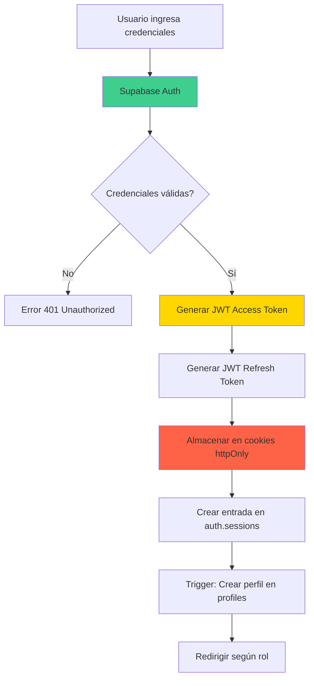
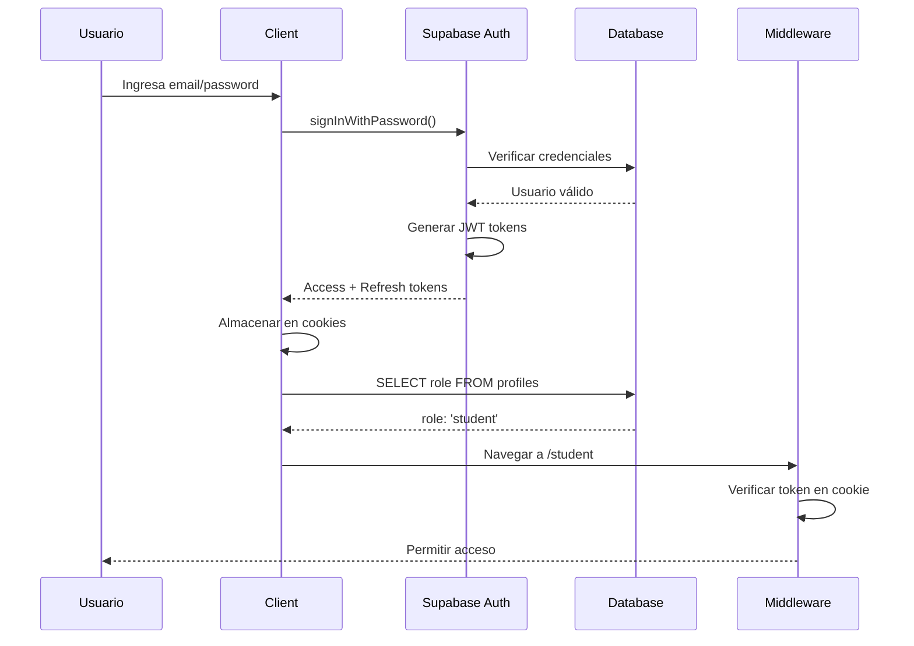
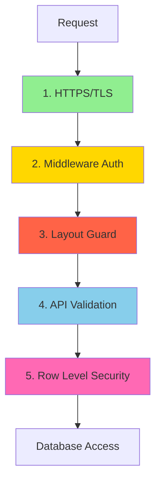

# Autenticación y Seguridad

## 1. Visión General de Seguridad

El Sistema de Asistencia Estudiantil implementa un modelo de seguridad **multi-capa** (defense in depth) que combina autenticación robusta, autorización a nivel de base de datos, y validaciones en múltiples niveles de la aplicación.

### Principios de Seguridad Implementados

1. **Authentication:** Verificar la identidad del usuario
2. **Authorization:** Verificar permisos y acceso a recursos
3. **Confidentiality:** Proteger datos sensibles (contraseñas, tokens)
4. **Integrity:** Garantizar que los datos no sean modificados indebidamente
5. **Availability:** Sistema disponible para usuarios autorizados
6. **Least Privilege:** Usuarios solo tienen permisos necesarios

---

## 2. Sistema de Autenticación (Supabase Auth)

### 2.1 Arquitectura de Autenticación



### 2.2 Flujo de Registro (Sign Up)

```typescript
// Client-side registration
const { data, error } = await supabase.auth.signUp({
  email: 'estudiante@universidad.edu',
  password: 'SecureP@ssw0rd',
  options: {
    data: {
      full_name: 'María González',
      role: 'student' // 'teacher' o 'student'
    },
    emailRedirectTo: `${window.location.origin}/auth/login?role=student`
  }
})
```

#### Pasos del Registro

1. **Validación Client-Side:**
   ```typescript
   const registerSchema = z.object({
     email: z.string().email('Email inválido'),
     password: z.string().min(8, 'Mínimo 8 caracteres')
                        .regex(/[A-Z]/, 'Debe contener mayúscula')
                        .regex(/[a-z]/, 'Debe contener minúscula')
                        .regex(/[0-9]/, 'Debe contener número'),
     full_name: z.string().min(3, 'Nombre muy corto'),
     role: z.enum(['teacher', 'student'])
   })
   ```

2. **Llamada a Supabase Auth:**
   - Hash de contraseña (bcrypt internamente)
   - Creación en tabla `auth.users`
   - Almacenamiento de metadata (`full_name`, `role`)

3. **Trigger Automático:**
   ```sql
   -- Se ejecuta automáticamente
   CREATE TRIGGER on_auth_user_created
     AFTER INSERT ON auth.users
     FOR EACH ROW
     EXECUTE FUNCTION handle_new_user();
   ```

4. **Envío de Email de Verificación:**
   - Email automático desde Supabase
   - Link de confirmación con token
   - Redirige a `/auth/login?role={role}` tras confirmar

5. **Respuesta al Cliente:**
   ```typescript
   {
     user: {
       id: 'uuid',
       email: 'estudiante@universidad.edu',
       email_confirmed_at: null, // null hasta confirmar
       user_metadata: {
         full_name: 'María González',
         role: 'student'
       }
     }
   }
   ```

### 2.3 Flujo de Login (Sign In)

```typescript
// Client-side login
const { data, error } = await supabase.auth.signInWithPassword({
  email: 'estudiante@universidad.edu',
  password: 'SecureP@ssw0rd'
})

if (data.user) {
  // Verificar rol desde base de datos
  const { data: profile } = await supabase
    .from('profiles')
    .select('role')
    .eq('id', data.user.id)
    .maybeSingle()

  // Redirigir según rol REAL (no metadata)
  if (profile?.role === 'teacher') {
    router.push('/teacher')
  } else {
    router.push('/student')
  }
}
```

#### Secuencia de Login



### 2.4 Tokens JWT

#### Access Token

```json
{
  "aud": "authenticated",
  "exp": 1699876543,
  "iat": 1699872943,
  "sub": "a1b2c3d4-e5f6-7890-abcd-ef1234567890",
  "email": "estudiante@universidad.edu",
  "role": "authenticated",
  "user_metadata": {
    "full_name": "María González",
    "role": "student"
  }
}
```

**Características:**
- **Algoritmo:** HS256 (HMAC SHA-256)
- **Expiración:** 1 hora (configurable)
- **Almacenamiento:** Cookie httpOnly
- **Uso:** Autenticación en cada request

#### Refresh Token

**Características:**
- **Expiración:** 7 días (configurable)
- **Propósito:** Renovar access token expirado
- **Almacenamiento:** Cookie httpOnly
- **Rotación:** Se genera nuevo refresh token en cada uso

#### Flujo de Refresh

```typescript
// Automático en middleware de Next.js
const { data, error } = await supabase.auth.refreshSession()

if (data.session) {
  // Nuevos tokens almacenados automáticamente
  console.log('Sesión renovada')
}
```

### 2.5 Logout

```typescript
// Client-side logout
await supabase.auth.signOut()

// Server-side: Elimina cookies y sesión en DB
// Redirige automáticamente a /auth/login
```

---

## 3. Middleware de Autenticación

### 3.1 Middleware de Next.js

```typescript
// middleware.ts
import { updateSession } from '@/lib/supabase/middleware'

export async function middleware(request: NextRequest) {
  return await updateSession(request)
}

export const config = {
  matcher: [
    '/((?!_next/static|_next/image|favicon.ico|.*\\.(?:svg|png|jpg|jpeg|gif|webp)$).*)',
  ],
}
```

#### Función `updateSession`

```typescript
// lib/supabase/middleware.ts
export async function updateSession(request: NextRequest) {
  let supabaseResponse = NextResponse.next({
    request,
  })

  const supabase = await createServerClient(
    process.env.NEXT_PUBLIC_SUPABASE_URL!,
    process.env.NEXT_PUBLIC_SUPABASE_ANON_KEY!,
    {
      cookies: {
        getAll() {
          return request.cookies.getAll()
        },
        setAll(cookiesToSet) {
          cookiesToSet.forEach(({ name, value, options }) =>
            request.cookies.set(name, value)
          )
          supabaseResponse = NextResponse.next({
            request,
          })
          cookiesToSet.forEach(({ name, value, options }) =>
            supabaseResponse.cookies.set(name, value, options)
          )
        },
      },
    }
  )

  // IMPORTANTE: Refrescar sesión
  const { data: { user } } = await supabase.auth.getUser()

  // Redirigir si no autenticado en rutas protegidas
  if (!user && request.nextUrl.pathname.startsWith('/teacher' || '/student')) {
    return NextResponse.redirect(new URL('/auth/login', request.url))
  }

  return supabaseResponse
}
```

### 3.2 Rutas Protegidas

**Públicas (sin autenticación):**
- `/` - Landing page
- `/auth/login` - Login
- `/auth/register` - Registro
- `/auth/verify-email` - Verificación de email

**Protegidas (requieren autenticación):**
- `/teacher/*` - Solo profesores
- `/student/*` - Solo estudiantes

---

## 4. Layout Guards (Verificación de Rol)

### 4.1 Guard de Profesor

```typescript
// app/teacher/layout.tsx
export default async function TeacherLayout({ children }) {
  const supabase = await createClient()

  // Verificar autenticación
  const { data: { user } } = await supabase.auth.getUser()

  if (!user) {
    redirect('/auth/login?role=teacher')
  }

  // Verificar rol REAL desde base de datos
  const { data: profile } = await supabase
    .from('profiles')
    .select('role')
    .eq('id', user.id)
    .maybeSingle()

  // Redirigir si no es profesor
  if (!profile || profile.role !== 'teacher') {
    redirect('/student') // Redirigir a dashboard correcto
  }

  return (
    <div>
      <TeacherNavigation />
      {children}
    </div>
  )
}
```

### 4.2 Guard de Estudiante

```typescript
// app/student/layout.tsx
export default async function StudentLayout({ children }) {
  const supabase = await createClient()

  const { data: { user } } = await supabase.auth.getUser()

  if (!user) {
    redirect('/auth/login?role=student')
  }

  const { data: profile } = await supabase
    .from('profiles')
    .select('role')
    .eq('id', user.id)
    .maybeSingle()

  if (!profile || profile.role !== 'student') {
    redirect('/teacher') // Redirigir a dashboard correcto
  }

  return (
    <div>
      <StudentNavigation />
      {children}
    </div>
  )
}
```

### 4.3 Prevención de Loops de Redirección

**Problema Anterior:**
```typescript
// ❌ MAL: Confiar en parámetro URL
const role = searchParams.get('role')
if (user.metadata.role !== role) {
  redirect(`/auth/login?role=${role}`)
}
// Causa loop infinito si metadata es incorrecto
```

**Solución Implementada:**
```typescript
// ✅ BIEN: Verificar rol real en base de datos
const { data: profile } = await supabase
  .from('profiles')
  .select('role')
  .eq('id', user.id)
  .maybeSingle()

// Redirigir a dashboard correcto (no a login)
if (profile?.role !== 'expected_role') {
  redirect('/correct-dashboard')
}
```

---

## 5. Row Level Security (RLS)

### 5.1 Capas de Seguridad



### 5.2 Ejemplo: Política de Subjects

```sql
-- Solo profesores pueden crear materias
CREATE POLICY "Teachers create subjects"
  ON subjects
  FOR INSERT
  TO authenticated
  WITH CHECK (
    -- Verificar que el usuario es el teacher_id
    auth.uid() = teacher_id
    AND
    -- Verificar que el usuario tiene rol 'teacher'
    EXISTS (
      SELECT 1 FROM profiles
      WHERE id = auth.uid()
        AND role = 'teacher'
    )
  );
```

**¿Cómo funciona?**

1. Usuario ejecuta INSERT:
   ```typescript
   await supabase.from('subjects').insert({
     name: 'Matemáticas',
     teacher_id: 'current-user-id'
   })
   ```

2. PostgreSQL verifica política:
   - `auth.uid()` devuelve ID del usuario autenticado (del JWT)
   - Compara con `teacher_id` en el INSERT
   - Verifica que `profiles.role = 'teacher'`

3. Resultado:
   - ✅ Pasa: INSERT se ejecuta
   - ❌ Falla: Error 403 Forbidden

### 5.3 Función `auth.uid()`

```sql
-- Obtener ID del usuario autenticado
SELECT auth.uid();

-- En políticas RLS
USING (auth.uid() = student_id)
```

**Implementación:**
- Lee el JWT del header `Authorization: Bearer {token}`
- Extrae el claim `sub` (subject) que contiene el user ID
- Retorna como UUID

---

## 6. Validación de Datos

### 6.1 Validación Client-Side (Zod)

```typescript
import { z } from 'zod'

// Schema de validación
const attendanceSchema = z.object({
  qrCode: z.string().min(10, 'Código QR inválido'),
  subjectId: z.string().uuid('ID de materia inválido'),
})

// Uso en formulario
const form = useForm({
  resolver: zodResolver(attendanceSchema)
})
```

**Ventajas:**
- Feedback inmediato al usuario
- Reduce carga del servidor
- Mejor UX

**Limitación:**
- Puede ser bypasseada (JavaScript en cliente)
- NO ES SUFICIENTE (necesita validación server-side)

### 6.2 Validación Server-Side (API Routes)

```typescript
// app/api/attendance-records/route.ts
export async function POST(request: Request) {
  const supabase = await createClient()

  // 1. Verificar autenticación
  const { data: { user } } = await supabase.auth.getUser()
  if (!user) {
    return Response.json({ error: 'Unauthorized' }, { status: 401 })
  }

  // 2. Parsear y validar body
  const body = await request.json()
  const result = attendanceSchema.safeParse(body)

  if (!result.success) {
    return Response.json(
      { error: 'Validación fallida', details: result.error },
      { status: 400 }
    )
  }

  // 3. Validaciones de negocio
  const { data: session } = await supabase
    .from('attendance_sessions')
    .select('expires_at, subject_id')
    .eq('qr_code', result.data.qrCode)
    .maybeSingle()

  if (!session) {
    return Response.json({ error: 'Sesión no encontrada' }, { status: 404 })
  }

  if (new Date(session.expires_at) < new Date()) {
    return Response.json({ error: 'Sesión expirada' }, { status: 410 })
  }

  // 4. Verificar inscripción
  const { data: enrollment } = await supabase
    .from('enrollments')
    .select('id')
    .eq('student_id', user.id)
    .eq('subject_id', session.subject_id)
    .maybeSingle()

  if (!enrollment) {
    return Response.json(
      { error: 'No estás inscrito en esta materia' },
      { status: 403 }
    )
  }

  // 5. Verificar duplicado
  const { data: existing } = await supabase
    .from('attendance_records')
    .select('id')
    .eq('session_id', session.id)
    .eq('student_id', user.id)
    .maybeSingle()

  if (existing) {
    return Response.json(
      { error: 'Ya registraste asistencia' },
      { status: 409 }
    )
  }

  // 6. Insertar registro (protegido por RLS)
  const { data, error } = await supabase
    .from('attendance_records')
    .insert({
      session_id: session.id,
      student_id: user.id,
      subject_id: session.subject_id
    })
    .select()
    .single()

  if (error) {
    return Response.json({ error: error.message }, { status: 500 })
  }

  return Response.json(data, { status: 201 })
}
```

---

## 7. Manejo de Sesiones

### 7.1 Cookies de Sesión

**Cookies Utilizadas:**

1. **sb-access-token:**
   - JWT de acceso
   - httpOnly: true (no accesible desde JavaScript)
   - secure: true (solo HTTPS en producción)
   - sameSite: 'lax'
   - maxAge: 3600 (1 hora)

2. **sb-refresh-token:**
   - JWT de refresco
   - httpOnly: true
   - secure: true
   - sameSite: 'lax'
   - maxAge: 604800 (7 días)

### 7.2 Configuración de Cookies

```typescript
// lib/supabase/client.ts (Browser)
export function createClient() {
  return createBrowserClient(
    process.env.NEXT_PUBLIC_SUPABASE_URL!,
    process.env.NEXT_PUBLIC_SUPABASE_ANON_KEY!
  )
}

// lib/supabase/server.ts (Server)
export async function createClient() {
  const cookieStore = await cookies()

  return createServerClient(
    process.env.NEXT_PUBLIC_SUPABASE_URL!,
    process.env.NEXT_PUBLIC_SUPABASE_ANON_KEY!,
    {
      cookies: {
        getAll() {
          return cookieStore.getAll()
        },
        setAll(cookiesToSet) {
          cookiesToSet.forEach(({ name, value, options }) =>
            cookieStore.set(name, value, options)
          )
        },
      },
    }
  )
}
```

### 7.3 Refresh Automático

```typescript
// Manejado automáticamente por @supabase/ssr
// En middleware.ts
const { data: { user } } = await supabase.auth.getUser()

// Si el access token está cerca de expirar:
// 1. Usa refresh token para obtener nuevo access token
// 2. Actualiza cookies automáticamente
// 3. Retorna nueva sesión
```

---

## 8. Protección Contra Vulnerabilidades Comunes

### 8.1 SQL Injection

**Prevención:**
- **Parameterized Queries:** Supabase client usa queries parametrizadas
- **RLS:** Capa adicional de protección

```typescript
// ✅ SEGURO: Supabase parameteriza automáticamente
const { data } = await supabase
  .from('subjects')
  .select('*')
  .eq('name', userInput) // Seguro incluso con input malicioso

// ❌ INSEGURO: SQL directo (NO USADO EN EL PROYECTO)
await supabase.rpc('execute_sql', {
  sql: `SELECT * FROM subjects WHERE name = '${userInput}'`
})
```

### 8.2 Cross-Site Scripting (XSS)

**Prevención:**
- **React auto-escaping:** React escapa automáticamente contenido
- **DOMPurify:** Para HTML no controlado (no usado actualmente)
- **Content Security Policy (CSP):** Headers configurados

```typescript
// ✅ SEGURO: React escapa automáticamente
<div>{userInput}</div>

// ❌ INSEGURO: dangerouslySetInnerHTML sin sanitizar
<div dangerouslySetInnerHTML={{ __html: userInput }} />

// ✅ SEGURO: Con DOMPurify
import DOMPurify from 'dompurify'
<div dangerouslySetInnerHTML={{
  __html: DOMPurify.sanitize(userInput)
}} />
```

### 8.3 Cross-Site Request Forgery (CSRF)

**Prevención:**
- **SameSite Cookies:** `sameSite: 'lax'` en todas las cookies
- **Origin Validation:** Middleware verifica origen de requests
- **JWT en Authorization header:** Para requests sensibles

### 8.4 Session Fixation

**Prevención:**
- **Nuevo session ID tras login:** Supabase genera nuevo JWT
- **Rotación de refresh token:** Nuevo token en cada refresh
- **Logout invalida sesión:** Elimina del servidor y cliente

### 8.5 Brute Force Attacks

**Mitigaciones:**
- **Rate Limiting:** Supabase aplica límites por IP
- **Account Lockout:** Tras múltiples intentos fallidos (configurable)
- **CAPTCHA:** Puede agregarse en login/registro

### 8.6 Credential Stuffing

**Prevención:**
- **Password Strength:** Validación de complejidad
- **Email Verification:** Confirmar propiedad de email
- **MFA (futuro):** Multi-factor authentication

---

## 9. Mejores Prácticas Implementadas

### 9.1 Principio de Mínimo Privilegio

```typescript
// Usuario solo puede acceder a sus propios datos
const { data } = await supabase
  .from('attendance_records')
  .select('*')
  // No filtra manualmente - RLS lo hace automáticamente
```

**RLS Policy garantiza:**
```sql
USING (auth.uid() = student_id)
```

### 9.2 Validación Multi-Capa

1. **Client-side:** Zod validation
2. **API Route:** Validación + lógica de negocio
3. **Database:** Constraints + RLS

### 9.3 Secrets Management

```bash
# .env.local (nunca en Git)
NEXT_PUBLIC_SUPABASE_URL=https://xxx.supabase.co
NEXT_PUBLIC_SUPABASE_ANON_KEY=eyJhbGciOi...

# .gitignore
.env.local
.env*.local
```

**ANON_KEY es seguro para cliente:**
- Solo permite operaciones autorizadas por RLS
- No da acceso administrativo
- Service Role Key (admin) NUNCA se expone

### 9.4 HTTPS Obligatorio

- **Desarrollo:** http://localhost (permitido)
- **Producción:** https:// (enforced por Vercel)

### 9.5 Security Headers

```typescript
// next.config.js
const securityHeaders = [
  {
    key: 'X-Frame-Options',
    value: 'DENY'
  },
  {
    key: 'X-Content-Type-Options',
    value: 'nosniff'
  },
  {
    key: 'Referrer-Policy',
    value: 'origin-when-cross-origin'
  }
]
```

---

## 10. Auditoría y Logging

### 10.1 Logs de Autenticación

**Supabase Dashboard:**
- Intentos de login (exitosos/fallidos)
- Registros de nuevos usuarios
- Cambios de contraseña
- Verificaciones de email

### 10.2 Logs de Base de Datos

```sql
-- Timestamps en todas las tablas
created_at TIMESTAMPTZ DEFAULT now()
scanned_at TIMESTAMPTZ DEFAULT now()
enrolled_at TIMESTAMPTZ DEFAULT now()
```

### 10.3 Logs de Aplicación

```typescript
// En producción con Vercel
console.log('Attendance recorded:', {
  studentId: user.id,
  subjectId: subjectId,
  timestamp: new Date().toISOString()
})
```

---

## 11. Checklist de Seguridad

### Autenticación
- ✅ Contraseñas hasheadas (bcrypt via Supabase)
- ✅ Email verification obligatoria
- ✅ JWT con expiración
- ✅ Refresh token rotation
- ✅ Logout invalida sesión

### Autorización
- ✅ Row Level Security habilitado
- ✅ Verificación de rol en layouts
- ✅ Validación de permisos en API
- ✅ Políticas granulares por tabla

### Datos
- ✅ HTTPS en producción
- ✅ Cookies httpOnly
- ✅ Secrets en variables de entorno
- ✅ No hay credentials en código

### Aplicación
- ✅ Validación client y server
- ✅ Parameterized queries
- ✅ React auto-escaping
- ✅ Rate limiting (Supabase)
- ✅ CORS configurado

### Infraestructura
- ✅ Database backups diarios
- ✅ Monitoring de errores
- ✅ Security headers
- ✅ Dependency updates

---

## Conclusión

El Sistema de Asistencia Estudiantil implementa un modelo de seguridad robusto y probado que combina:

- **Autenticación fuerte** con Supabase Auth y JWT
- **Autorización granular** con Row Level Security
- **Validación multi-capa** en cliente, servidor y base de datos
- **Protección contra vulnerabilidades comunes** (XSS, SQLi, CSRF)
- **Mejores prácticas de industria** (HTTPS, secrets management, logging)

Esta arquitectura de seguridad garantiza que:
- Solo usuarios autenticados pueden acceder al sistema
- Cada usuario solo puede acceder a sus propios datos
- Los datos sensibles están protegidos en tránsito y reposo
- Las operaciones son auditables y trazables

---

[← Base de Datos](04-BASE_DE_DATOS.md) | [Volver al Índice](README.md) | [Siguiente: Funcionalidades →](06-FUNCIONALIDADES.md)
