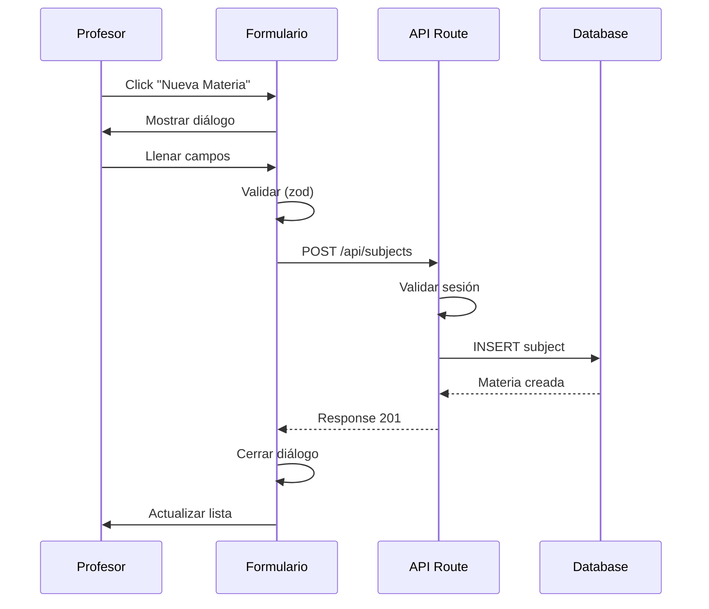
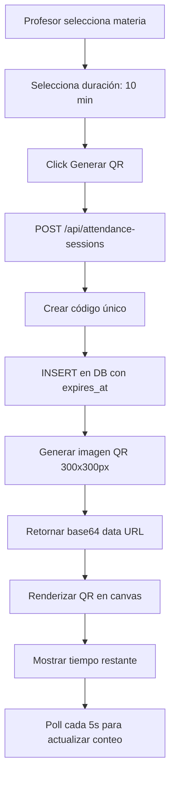
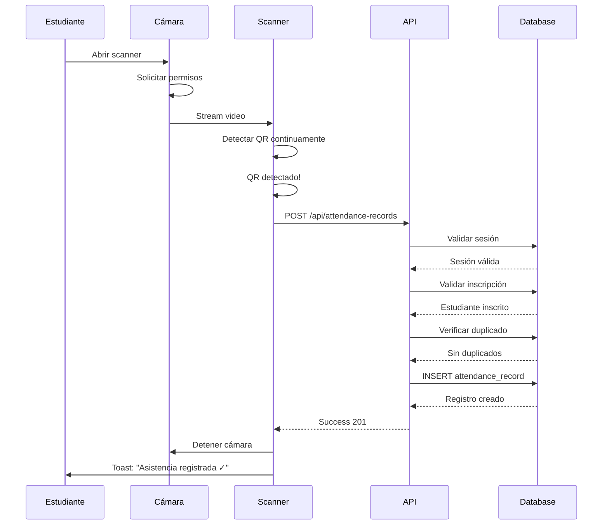

# Funcionalidades del Sistema

## 1. Visión General

El Sistema de Asistencia Estudiantil ofrece dos interfaces principales: una para **profesores** y otra para **estudiantes**, cada una con funcionalidades específicas adaptadas a sus necesidades y roles.

---

## 2. Funcionalidades para Profesores

### 2.1 Gestión de Materias

#### Crear Nueva Materia

**Ruta:** `/teacher` → Botón "Nueva Materia"

**Campos del Formulario:**
- Nombre de la materia (requerido, mín. 3 caracteres)
- Código de la materia (requerido, ej: "MAT101")
- Horario (opcional)
- Descripción (opcional, textarea)

**Flujo:**


**Validaciones:**
- ✅ Nombre no vacío
- ✅ Código no vacío
- ✅ Usuario autenticado
- ✅ Usuario tiene rol 'teacher'
- ✅ teacher_id = usuario actual (RLS)

**Resultado:**
- Nueva materia visible en dashboard
- Puede generar QR inmediatamente
- Conteo de estudiantes en 0

---

#### Ver Mis Materias

**Ruta:** `/teacher`

**Visualización:**
- Grid responsivo de tarjetas
- Cada tarjeta muestra:
  - Nombre de la materia
  - Código
  - Horario (si existe)
  - Número de estudiantes inscritos
  - Botones de acción:
    - "Ver detalles"
    - "Editar"
    - "Eliminar"
    - "Generar QR"

**Query SQL:**
```sql
SELECT
  s.*,
  COUNT(DISTINCT e.student_id) as student_count
FROM subjects s
LEFT JOIN enrollments e ON s.id = e.subject_id
WHERE s.teacher_id = auth.uid()
GROUP BY s.id
ORDER BY s.created_at DESC;
```

---

#### Editar Materia

**Flujo:**
1. Click en "Editar" en tarjeta de materia
2. Diálogo pre-llenado con datos actuales
3. Modificar campos deseados
4. Guardar cambios

**Validaciones:**
- Solo el profesor creador puede editar (RLS)
- Mismas validaciones que crear

---

#### Eliminar Materia

**Flujo:**
1. Click en "Eliminar"
2. Diálogo de confirmación
3. Confirmar eliminación

**Advertencia mostrada:**
> "¿Estás seguro? Esta acción eliminará la materia, todas las inscripciones, sesiones de QR y registros de asistencia asociados."

**Cascada de eliminación:**
```
subjects (eliminada)
  ├── enrollments (eliminadas)
  ├── attendance_sessions (eliminadas)
  │     └── attendance_records (eliminadas)
  └── attendance_records (eliminadas directamente)
```

---

### 2.2 Generación de Códigos QR

#### Generar QR para Asistencia

**Ruta:** `/teacher/qr`

**Interfaz:**
- Selector de materia (dropdown)
- Selector de tiempo de expiración (5-60 minutos)
- Botón "Generar QR"
- Vista previa del QR generado
- Información de sesión activa

**Flujo:**


**Código QR Formato:**
```
{subjectId}-{timestamp}-{random}

Ejemplo:
abc123-1699876543210-x7k2m9p
```

**Pantalla muestra:**
- Código QR grande (300x300px)
- Nombre de la materia
- Tiempo de expiración (cuenta regresiva)
- Número de estudiantes que han escaneado (en tiempo real)
- Botón "Terminar sesión" (manual)
- Botón "Generar nuevo QR"

**Actualización en Tiempo Real:**
```typescript
// Realtime subscription
useEffect(() => {
  const channel = supabase
    .channel('attendance_updates')
    .on(
      'postgres_changes',
      {
        event: 'INSERT',
        schema: 'public',
        table: 'attendance_records',
        filter: `subject_id=eq.${subjectId}`
      },
      () => {
        // Actualizar conteo
        fetchAttendanceCount()
      }
    )
    .subscribe()

  return () => supabase.removeChannel(channel)
}, [subjectId])
```

---

### 2.3 Gestión de Estudiantes

#### Ver Estudiantes Inscritos

**Ruta:** `/teacher` → Click en materia → "Estudiantes"

**Visualización:**
- Tabla con columnas:
  - Nombre completo
  - Email
  - Fecha de inscripción
  - Acciones (Remover)
- Botón "Agregar estudiante"

**Query:**
```sql
SELECT
  p.id,
  p.full_name,
  p.email,
  e.enrolled_at
FROM enrollments e
JOIN profiles p ON e.student_id = p.id
WHERE e.subject_id = '{subject_id}'
ORDER BY e.enrolled_at DESC;
```

---

#### Agregar Estudiante por Email

**Flujo:**
1. Click "Agregar estudiante"
2. Ingresar email del estudiante
3. Sistema busca usuario con ese email
4. Si existe y tiene rol 'student', crea inscripción
5. Si no existe, muestra error

**Validaciones:**
- Email válido
- Usuario existe en sistema
- Usuario tiene rol 'student'
- No está ya inscrito (UNIQUE constraint)

**Código:**
```typescript
async function enrollStudent(email: string, subjectId: string) {
  // 1. Buscar estudiante por email
  const { data: student } = await supabase
    .from('profiles')
    .select('id, role')
    .eq('email', email)
    .eq('role', 'student')
    .maybeSingle()

  if (!student) {
    throw new Error('Estudiante no encontrado')
  }

  // 2. Crear inscripción
  const { error } = await supabase
    .from('enrollments')
    .insert({
      student_id: student.id,
      subject_id: subjectId
    })

  if (error) {
    if (error.code === '23505') { // UNIQUE violation
      throw new Error('Estudiante ya está inscrito')
    }
    throw error
  }
}
```

---

#### Remover Estudiante

**Flujo:**
1. Click en "Remover" junto al estudiante
2. Confirmación
3. Eliminar inscripción

**Advertencia:**
> "Al remover al estudiante, perderá acceso a escanear QR de esta materia, pero sus registros históricos de asistencia se mantendrán."

---

### 2.4 Reportes de Asistencia

#### Generar Reporte

**Ruta:** `/teacher/reports`

**Filtros disponibles:**
- Materia (dropdown, o "Todas")
- Rango de fechas (date pickers)
  - Fecha inicio
  - Fecha fin

**Visualización:**
- Tabla con columnas:
  - Nombre del estudiante
  - Email
  - Materia
  - Fecha y hora de escaneo
  - Código de sesión (truncado)
- Paginación (20 registros por página)
- Total de registros encontrados

**Query:**
```sql
SELECT
  p.full_name,
  p.email,
  s.name as subject_name,
  s.code as subject_code,
  ar.scanned_at,
  ar.session_id
FROM attendance_records ar
JOIN profiles p ON ar.student_id = p.id
JOIN subjects s ON ar.subject_id = s.id
WHERE s.teacher_id = auth.uid()
  AND (ar.subject_id = $1 OR $1 IS NULL)
  AND ar.scanned_at >= $2
  AND ar.scanned_at <= $3
ORDER BY ar.scanned_at DESC
LIMIT 20 OFFSET $4;
```

---

#### Exportar a CSV

**Botón:** "Exportar CSV"

**Proceso:**
1. Obtener datos filtrados (sin límite de paginación)
2. Generar CSV en cliente
3. Trigger download automático

**Formato CSV:**
```csv
Estudiante,Email,Materia,Código,Fecha,Hora
María González,maria@universidad.edu,Matemáticas,MAT101,2024-11-13,10:35:00
Juan Pérez,juan@universidad.edu,Matemáticas,MAT101,2024-11-13,10:36:00
...
```

**Código:**
```typescript
function exportToCSV(data: AttendanceRecord[]) {
  const headers = ['Estudiante', 'Email', 'Materia', 'Código', 'Fecha', 'Hora']

  const rows = data.map(record => [
    record.student_name,
    record.student_email,
    record.subject_name,
    record.subject_code,
    format(new Date(record.scanned_at), 'yyyy-MM-dd'),
    format(new Date(record.scanned_at), 'HH:mm:ss')
  ])

  const csv = [
    headers.join(','),
    ...rows.map(row => row.join(','))
  ].join('\n')

  const blob = new Blob([csv], { type: 'text/csv' })
  const url = URL.createObjectURL(blob)
  const a = document.createElement('a')
  a.href = url
  a.download = `asistencia-${format(new Date(), 'yyyy-MM-dd')}.csv`
  a.click()
}
```

---

### 2.5 Navegación (Profesor)

**Desktop:**
- Top navigation bar
- Links:
  - "Dashboard" → `/teacher`
  - "Generar QR" → `/teacher/qr`
  - "Reportes" → `/teacher/reports`
  - "Perfil" (dropdown)
    - "Mi Perfil"
    - "Cerrar Sesión"

**Mobile:**
- Top bar minimalista (logo + menú hamburguesa)
- Bottom navigation:
  - Dashboard (icono casa)
  - QR (icono qrcode)
  - Reportes (icono gráfico)
- Hamburger menu para perfil y logout

---

## 3. Funcionalidades para Estudiantes

### 3.1 Explorar y Inscribirse en Materias

#### Ver Catálogo de Materias

**Ruta:** `/student/subjects`

**Visualización:**
- Grid de tarjetas con todas las materias disponibles
- Cada tarjeta muestra:
  - Nombre de la materia
  - Código
  - Horario
  - Nombre del profesor
  - Estado: "Inscrito" o "Inscribirse"

**Query:**
```sql
SELECT
  s.*,
  p.full_name as teacher_name,
  EXISTS (
    SELECT 1 FROM enrollments
    WHERE student_id = auth.uid()
      AND subject_id = s.id
  ) as is_enrolled
FROM subjects s
JOIN profiles p ON s.teacher_id = p.id
ORDER BY s.name;
```

---

#### Inscribirse en Materia

**Flujo:**
1. Click en "Inscribirse" en tarjeta
2. Confirmación rápida
3. Crear inscripción automáticamente

**Sin formulario adicional - inscripción inmediata**

**Validaciones (RLS + API):**
- Usuario autenticado
- Usuario es estudiante
- No está ya inscrito (UNIQUE)

**Feedback:**
- Toast de éxito: "Te has inscrito en [Materia]"
- Botón cambia a "Inscrito" (deshabilitado)
- Tarjeta con borde verde

---

### 3.2 Ver Mis Materias Inscritas

**Ruta:** `/student` (Dashboard)

**Visualización:**
- Lista de materias inscritas
- Cada tarjeta muestra:
  - Nombre y código
  - Horario
  - Nombre del profesor
  - Botón "Escanear QR"
  - Link "Ver historial de asistencia"

**Acciones rápidas:**
- Desde aquí puede abrir scanner de QR directamente

---

### 3.3 Escanear Códigos QR

#### Abrir Scanner

**Ubicaciones:**
- Botón flotante en dashboard principal
- Botón en tarjeta de cada materia
- Ruta directa: `/student` → Click botón QR

**Interfaz:**
- Diálogo modal full-screen (mobile) o grande (desktop)
- Vista previa de cámara
- Marco de enfoque para QR
- Texto: "Enfoca el código QR de asistencia"
- Botón "Cancelar"

---

#### Proceso de Escaneo



---

#### Permisos de Cámara

**Primera vez:**
```typescript
// Solicitar permisos explícitamente
async function requestCameraPermission() {
  try {
    const stream = await navigator.mediaDevices.getUserMedia({
      video: { facingMode: 'environment' } // Cámara trasera
    })
    // Permiso concedido
    stream.getTracks().forEach(track => track.stop())
    return true
  } catch (error) {
    if (error.name === 'NotAllowedError') {
      alert('Debes permitir acceso a la cámara para escanear QR')
    } else if (error.name === 'NotFoundError') {
      alert('No se encontró cámara en tu dispositivo')
    }
    return false
  }
}
```

**Selección de cámara:**
- Automática: Prioriza cámara trasera en móviles
- Manual: Botón para cambiar entre cámaras (si hay múltiples)

---

#### Validaciones en Escaneo

1. **Sesión existe:**
   ```
   Error 404: "Código QR no válido o sesión no encontrada"
   ```

2. **Sesión no expirada:**
   ```
   Error 410: "Esta sesión de asistencia ya expiró"
   ```

3. **Estudiante inscrito:**
   ```
   Error 403: "No estás inscrito en esta materia"
   ```

4. **Sin duplicado:**
   ```
   Error 409: "Ya registraste tu asistencia en esta sesión"
   ```

5. **Éxito:**
   ```
   Success 201: "¡Asistencia registrada exitosamente!"
   ```

**Todas muestran toast con icono correspondiente**

---

### 3.4 Ver Historial de Asistencia

#### Mis Asistencias

**Ruta:** `/student/history`

**Filtros:**
- Por materia (dropdown)
- Por rango de fechas

**Visualización:**
- Tabla responsive con:
  - Materia y código
  - Fecha y hora del escaneo
  - Estado: "Presente" (con check verde)
- Ordenado por fecha DESC (más recientes primero)

**Query:**
```sql
SELECT
  s.name as subject_name,
  s.code as subject_code,
  ar.scanned_at
FROM attendance_records ar
JOIN subjects s ON ar.subject_id = s.id
WHERE ar.student_id = auth.uid()
  AND (ar.subject_id = $1 OR $1 IS NULL)
  AND ar.scanned_at BETWEEN $2 AND $3
ORDER BY ar.scanned_at DESC;
```

**Estadísticas mostradas:**
- Total de asistencias registradas
- Materias con asistencia
- Última asistencia

---

### 3.5 Navegación (Estudiante)

**Desktop:**
- Top navigation bar
- Links:
  - "Dashboard" → `/student`
  - "Explorar Materias" → `/student/subjects`
  - "Mi Historial" → `/student/history`
  - "Perfil" (dropdown)

**Mobile:**
- Top bar simple
- Bottom navigation:
  - Dashboard (icono casa)
  - Materias (icono libro)
  - Historial (icono reloj)
- Botón flotante central grande: "Escanear QR"

---

## 4. Funcionalidades Comunes

### 4.1 Perfil de Usuario

**Ruta:** Dropdown "Perfil" → "Mi Perfil"

**Información mostrada:**
- Nombre completo
- Email
- Rol (Profesor/Estudiante)
- Fecha de registro

**Editar perfil:**
- Cambiar nombre completo
- (Email y rol no editables)

---

### 4.2 Cambiar Contraseña

**Ubicación:** Perfil → "Cambiar contraseña"

**Flujo:**
1. Ingresar contraseña actual
2. Ingresar nueva contraseña
3. Confirmar nueva contraseña

**Validaciones:**
- Contraseña actual correcta
- Nueva contraseña cumple requisitos:
  - Mínimo 8 caracteres
  - Al menos 1 mayúscula
  - Al menos 1 minúscula
  - Al menos 1 número
- Contraseñas coinciden

---

### 4.3 Cerrar Sesión

**Ubicación:** Perfil dropdown → "Cerrar sesión"

**Proceso:**
1. Click en "Cerrar sesión"
2. Confirmación opcional
3. Llamar a `supabase.auth.signOut()`
4. Eliminar cookies de sesión
5. Redirect a `/auth/login`

---

### 4.4 Notificaciones Toast

**Tipos de notificaciones:**

1. **Éxito (verde):**
   - "Materia creada exitosamente"
   - "Asistencia registrada"
   - "Inscripción exitosa"

2. **Error (rojo):**
   - "Error al crear materia"
   - "Sesión expirada"
   - "No estás inscrito"

3. **Advertencia (amarillo):**
   - "La sesión expirará en 2 minutos"

4. **Información (azul):**
   - "QR generado"
   - "Reporte exportado"

**Duración:** 3-5 segundos
**Posición:** Top-right (desktop), Top-center (mobile)
**Descartar:** Auto o click en X

---

### 4.5 Modo Oscuro/Claro

**Toggle:** Header → Icono sol/luna

**Implementación:**
```typescript
import { useTheme } from 'next-themes'

function ThemeToggle() {
  const { theme, setTheme } = useTheme()

  return (
    <button onClick={() => setTheme(theme === 'dark' ? 'light' : 'dark')}>
      {theme === 'dark' ? '☀️' : '🌙'}
    </button>
  )
}
```

**Persistencia:** LocalStorage
**Detección automática:** System preference al primer uso

---

## 5. Estados de Carga y Errores

### 5.1 Loading States

**Skeleton loaders:**
- Al cargar lista de materias
- Al cargar reportes
- Al procesar inscripción

**Spinners:**
- Botones durante submit
- Generación de QR
- Export de CSV

---

### 5.2 Estados Vacíos

**Profesor sin materias:**
```
📚 No tienes materias creadas aún

Crea tu primera materia para comenzar a gestionar
asistencia de tus estudiantes.

[Crear Materia]
```

**Estudiante sin inscripciones:**
```
🎓 No estás inscrito en ninguna materia

Explora el catálogo y inscríbete en las materias
que te interesen.

[Explorar Materias]
```

**Sin historial de asistencia:**
```
📅 Aún no has registrado asistencia

Escanea los códigos QR en tus clases para
registrar tu presencia.

[Escanear QR]
```

---

### 5.3 Error Boundaries

**Errores de red:**
- Retry automático (3 intentos)
- Mensaje: "Error de conexión. Reintentando..."

**Errores de servidor (500):**
- Mensaje genérico
- Botón "Reportar problema"

**Sesión expirada:**
- Redirect automático a login
- Mensaje: "Tu sesión ha expirado. Por favor inicia sesión nuevamente."

---

## 6. Responsive Design

### Desktop (≥1024px)
- Layout de 2-3 columnas
- Top navigation completa
- Diálogos centrales
- Hover effects

### Tablet (768px-1023px)
- Layout de 2 columnas
- Top navigation condensada
- Diálogos adaptados

### Mobile (<768px)
- Layout de 1 columna
- Bottom navigation
- Diálogos full-screen
- Touch-optimized buttons (mín 44px)
- Scanner QR full-screen

---

## Conclusión

El Sistema de Asistencia Estudiantil ofrece interfaces intuitivas y completas tanto para profesores como estudiantes, con funcionalidades específicas que facilitan:

**Para Profesores:**
- Gestión eficiente de materias y estudiantes
- Generación rápida de QR con feedback en tiempo real
- Reportes detallados y exportables

**Para Estudiantes:**
- Inscripción sencilla en materias
- Escaneo de QR rápido y confiable
- Historial completo de asistencia

Todas las funcionalidades están diseñadas con UX en mente, proporcionando feedback inmediato, validaciones claras y flujos optimizados.

---

[← Autenticación y Seguridad](05-AUTENTICACION_SEGURIDAD.md) | [Volver al Índice](README.md) | [Siguiente: Implementación QR →](07-QR_IMPLEMENTACION.md)
