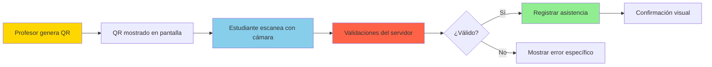

# Implementación de Códigos QR

## 1. Visión General

El sistema de códigos QR es el componente central del Sistema de Asistencia Estudiantil. Permite registrar asistencia de manera rápida y segura mediante la generación de códigos temporales por parte de profesores y su escaneo por estudiantes.

### Flujo Completo



---

## 2. Generación de Códigos QR (Servidor)

### 2.1 Librería Utilizada: `qrcode`

```bash
npm install qrcode
npm install @types/qrcode --save-dev
```

**Características:**
- Ligera (~50KB)
- Soporte para múltiples formatos (PNG, SVG, Terminal, Data URL)
- Alta personalización (colores, tamaño, corrección de errores)
- Sin dependencias externas

---

### 2.2 Servicio de Generación: `QRService`

**Ubicación:** `lib/qr/generator.ts`

```typescript
import QRCode from 'qrcode'

export class QRService {
  /**
   * Genera un código QR único para asistencia
   * Formato: {subjectId}-{timestamp}-{random}
   */
  static generateQRCode(subjectId: string): string {
    const timestamp = Date.now()
    const random = Math.random().toString(36).substring(7)
    return `${subjectId}-${timestamp}-${random}`
  }

  /**
   * Genera imagen QR como Data URL (base64)
   * Para usar en 
   */
  static async generateQRImage(
    qrCode: string,
    options?: QRCode.QRCodeToDataURLOptions
  ): Promise<string> {
    const defaultOptions: QRCode.QRCodeToDataURLOptions = {
      width: 300,
      margin: 2,
      color: {
        dark: '#000000',
        light: '#FFFFFF'
      },
      errorCorrectionLevel: 'M'
    }

    return await QRCode.toDataURL(qrCode, { ...defaultOptions, ...options })
  }

  /**
   * Genera QR como SVG string
   * Mejor calidad para impresión
   */
  static async generateQRSVG(
    qrCode: string,
    options?: QRCode.QRCodeToStringOptions
  ): Promise<string> {
    return await QRCode.toString(qrCode, {
      type: 'svg',
      width: 300,
      ...options
    })
  }

  /**
   * Genera QR con opciones personalizadas (colores, logo, etc.)
   */
  static async generateQRImageWithOptions(
    qrCode: string,
    customOptions: {
      size?: number
      darkColor?: string
      lightColor?: string
    }
  ): Promise<string> {
    const { size = 300, darkColor = '#000000', lightColor = '#FFFFFF' } = customOptions

    return await QRCode.toDataURL(qrCode, {
      width: size,
      margin: 2,
      color: {
        dark: darkColor,
        light: lightColor
      }
    })
  }

  /**
   * Valida formato de código QR
   */
  static isValidQRFormat(qrCode: string): boolean {
    const pattern = /^[a-f0-9-]+-\d+-[a-z0-9]+$/i
    return pattern.test(qrCode)
  }

  /**
   * Parsea código QR para extraer componentes
   */
  static parseQRCode(qrCode: string): {
    subjectId: string
    timestamp: number
    random: string
  } | null {
    if (!this.isValidQRFormat(qrCode)) {
      return null
    }

    const parts = qrCode.split('-')
    // Formato: uuid-uuid-uuid-uuid-timestamp-random
    // Necesitamos reconstruir el UUID (primeros 5 segmentos)
    const subjectId = parts.slice(0, -2).join('-')
    const timestamp = parseInt(parts[parts.length - 2])
    const random = parts[parts.length - 1]

    return { subjectId, timestamp, random }
  }
}
```

---

### 2.3 API Route: Generar Sesión QR

**Ruta:** `POST /api/attendance-sessions`

**Body:**
```json
{
  "subjectId": "uuid",
  "expiresInMinutes": 10
}
```

**Implementación:**
```typescript
// app/api/attendance-sessions/route.ts
import { createClient } from '@/lib/supabase/server'
import { QRService } from '@/lib/qr/generator'

export async function POST(request: Request) {
  try {
    const supabase = await createClient()

    // 1. Verificar autenticación
    const { data: { user }, error: authError } = await supabase.auth.getUser()

    if (authError || !user) {
      return Response.json(
        { error: 'No autorizado' },
        { status: 401 }
      )
    }

    // 2. Parsear body
    const body = await request.json()
    const { subjectId, expiresInMinutes = 10 } = body

    // 3. Validar que la materia pertenece al profesor
    const { data: subject, error: subjectError } = await supabase
      .from('subjects')
      .select('id, name')
      .eq('id', subjectId)
      .eq('teacher_id', user.id)
      .maybeSingle()

    if (subjectError || !subject) {
      return Response.json(
        { error: 'Materia no encontrada o no autorizado' },
        { status: 404 }
      )
    }

    // 4. Generar código QR único
    const qrCode = QRService.generateQRCode(subjectId)

    // 5. Calcular fecha de expiración
    const expiresAt = new Date()
    expiresAt.setMinutes(expiresAt.getMinutes() + expiresInMinutes)

    // 6. Crear sesión en base de datos
    const { data: session, error: sessionError } = await supabase
      .from('attendance_sessions')
      .insert({
        subject_id: subjectId,
        qr_code: qrCode,
        expires_at: expiresAt.toISOString()
      })
      .select()
      .single()

    if (sessionError) {
      console.error('Error creating session:', sessionError)
      return Response.json(
        { error: 'Error al crear sesión' },
        { status: 500 }
      )
    }

    // 7. Generar imagen QR
    const qrImageDataUrl = await QRService.generateQRImage(qrCode)

    // 8. Retornar sesión con imagen
    return Response.json({
      session: {
        ...session,
        subject_name: subject.name
      },
      qrImage: qrImageDataUrl
    }, { status: 201 })

  } catch (error) {
    console.error('Error in POST /api/attendance-sessions:', error)
    return Response.json(
      { error: 'Error interno del servidor' },
      { status: 500 }
    )
  }
}
```

---

### 2.4 Componente React: Generador QR

**Ubicación:** `components/qr-generator-card.tsx`

```typescript
'use client'

import { useState } from 'react'
import { Button } from '@/components/ui/button'
import { Card, CardContent, CardHeader, CardTitle } from '@/components/ui/card'
import { Select, SelectContent, SelectItem, SelectTrigger, SelectValue } from '@/components/ui/select'
import { QRService } from '@/lib/qr/generator'

interface Subject {
  id: string
  name: string
}

export function QRGeneratorCard({ subjects }: { subjects: Subject[] }) {
  const [selectedSubjectId, setSelectedSubjectId] = useState<string>('')
  const [expiresInMinutes, setExpiresInMinutes] = useState<number>(10)
  const [qrImageUrl, setQrImageUrl] = useState<string | null>(null)
  const [session, setSession] = useState<any>(null)
  const [loading, setLoading] = useState(false)

  async function handleGenerateQR() {
    if (!selectedSubjectId) {
      alert('Selecciona una materia')
      return
    }

    setLoading(true)

    try {
      const response = await fetch('/api/attendance-sessions', {
        method: 'POST',
        headers: { 'Content-Type': 'application/json' },
        body: JSON.stringify({
          subjectId: selectedSubjectId,
          expiresInMinutes
        })
      })

      if (!response.ok) {
        throw new Error('Error al generar QR')
      }

      const data = await response.json()

      setSession(data.session)
      setQrImageUrl(data.qrImage)

    } catch (error) {
      console.error('Error:', error)
      alert('Error al generar código QR')
    } finally {
      setLoading(false)
    }
  }

  return (
    <Card>
      <CardHeader>
        <CardTitle>Generar Código QR para Asistencia</CardTitle>
      </CardHeader>
      <CardContent className="space-y-4">
        {/* Selector de materia */}
        <div>
          <label className="text-sm font-medium">Materia</label>
          <Select value={selectedSubjectId} onValueChange={setSelectedSubjectId}>
            <SelectTrigger>
              <SelectValue placeholder="Selecciona una materia" />
            </SelectTrigger>
            <SelectContent>
              {subjects.map(subject => (
                <SelectItem key={subject.id} value={subject.id}>
                  {subject.name}
                </SelectItem>
              ))}
            </SelectContent>
          </Select>
        </div>

        {/* Selector de duración */}
        <div>
          <label className="text-sm font-medium">Duración (minutos)</label>
          <Select
            value={expiresInMinutes.toString()}
            onValueChange={(val) => setExpiresInMinutes(parseInt(val))}
          >
            <SelectTrigger>
              <SelectValue />
            </SelectTrigger>
            <SelectContent>
              <SelectItem value="5">5 minutos</SelectItem>
              <SelectItem value="10">10 minutos</SelectItem>
              <SelectItem value="15">15 minutos</SelectItem>
              <SelectItem value="30">30 minutos</SelectItem>
              <SelectItem value="60">60 minutos</SelectItem>
            </SelectContent>
          </Select>
        </div>

        {/* Botón generar */}
        <Button
          onClick={handleGenerateQR}
          disabled={loading || !selectedSubjectId}
          className="w-full"
        >
          {loading ? 'Generando...' : 'Generar Código QR'}
        </Button>

        {/* Mostrar QR generado */}
        {qrImageUrl && session && (
          <div className="mt-6 text-center">
            
            <p className="mt-4 text-sm text-muted-foreground">
              Materia: <strong>{session.subject_name}</strong>
            </p>
            <p className="text-sm text-muted-foreground">
              Expira: <TimeRemaining expiresAt={session.expires_at} />
            </p>
          </div>
        )}
      </CardContent>
    </Card>
  )
}

// Componente para mostrar tiempo restante
function TimeRemaining({ expiresAt }: { expiresAt: string }) {
  const [timeLeft, setTimeLeft] = useState('')

  useEffect(() => {
    const interval = setInterval(() => {
      const now = new Date()
      const expires = new Date(expiresAt)
      const diff = expires.getTime() - now.getTime()

      if (diff <= 0) {
        setTimeLeft('Expirado')
        clearInterval(interval)
      } else {
        const minutes = Math.floor(diff / 60000)
        const seconds = Math.floor((diff % 60000) / 1000)
        setTimeLeft(`${minutes}:${seconds.toString().padStart(2, '0')}`)
      }
    }, 1000)

    return () => clearInterval(interval)
  }, [expiresAt])

  return <strong>{timeLeft}</strong>
}
```

---

## 3. Escaneo de Códigos QR (Cliente)

### 3.1 Librería Utilizada: `@zxing/browser`

```bash
npm install @zxing/browser @zxing/library
```

**Características:**
- Detecta múltiples formatos de códigos (QR, EAN, Code128, etc.)
- Acceso a cámara web/móvil
- Alta precisión de detección
- TypeScript support completo

---

### 3.2 Servicio de Escaneo: `QRScanner`

**Ubicación:** `lib/qr/scanner.ts`

```typescript
import { BrowserMultiFormatReader, IScannerControls } from '@zxing/browser'

export class QRScanner {
  private static reader: BrowserMultiFormatReader | null = null

  /**
   * Inicializa el scanner con un elemento de video
   */
  static async initScanner(
    videoElement: HTMLVideoElement,
    onDecode: (result: string) => void,
    onError: (error: Error) => void
  ): Promise<IScannerControls> {
    // Crear reader si no existe
    if (!this.reader) {
      this.reader = new BrowserMultiFormatReader()
    }

    try {
      // Obtener cámara preferida (trasera en móviles)
      const deviceId = await this.getPreferredCamera()

      // Iniciar decodificación
      const controls = await this.reader.decodeFromVideoDevice(
        deviceId,
        videoElement,
        (result, error) => {
          if (result) {
            onDecode(result.getText())
          }
          if (error && !(error.name === 'NotFoundException')) {
            // NotFoundException se lanza continuamente cuando no hay QR
            onError(error)
          }
        }
      )

      return controls

    } catch (error) {
      onError(error as Error)
      throw error
    }
  }

  /**
   * Obtiene lista de cámaras disponibles
   */
  static async getCameras(): Promise<MediaDeviceInfo[]> {
    const devices = await navigator.mediaDevices.enumerateDevices()
    return devices.filter(device => device.kind === 'videoinput')
  }

  /**
   * Obtiene ID de la cámara preferida (trasera en móviles)
   */
  static async getPreferredCamera(): Promise<string | undefined> {
    const cameras = await this.getCameras()

    if (cameras.length === 0) {
      throw new Error('No se encontró ninguna cámara')
    }

    // Buscar cámara trasera (environment)
    const backCamera = cameras.find(camera =>
      camera.label.toLowerCase().includes('back') ||
      camera.label.toLowerCase().includes('rear') ||
      camera.label.toLowerCase().includes('environment')
    )

    return backCamera?.deviceId || cameras[0].deviceId
  }

  /**
   * Solicita permisos de cámara explícitamente
   */
  static async requestCameraPermission(): Promise<boolean> {
    try {
      const stream = await navigator.mediaDevices.getUserMedia({
        video: { facingMode: 'environment' }
      })

      // Detener stream inmediatamente
      stream.getTracks().forEach(track => track.stop())

      return true
    } catch (error: any) {
      if (error.name === 'NotAllowedError') {
        console.error('Permiso de cámara denegado')
      } else if (error.name === 'NotFoundError') {
        console.error('No se encontró cámara')
      }
      return false
    }
  }

  /**
   * Verifica si el dispositivo soporta cámara
   */
  static isCameraSupported(): boolean {
    return !!(
      navigator.mediaDevices &&
      navigator.mediaDevices.getUserMedia
    )
  }

  /**
   * Detiene el scanner (IMPORTANTE: usar .stop(), NO .reset())
   */
  static stopScanner(controls: IScannerControls): void {
    if (controls) {
      controls.stop() // ✅ Correcto
      // controls.reset() // ❌ Incorrecto - deja la cámara activa
    }
  }
}
```

---

### 3.3 Componente React: Scanner QR

**Ubicación:** `components/qr-scanner-dialog.tsx`

```typescript
'use client'

import { useRef, useState, useEffect } from 'react'
import { Dialog, DialogContent, DialogHeader, DialogTitle } from '@/components/ui/dialog'
import { Button } from '@/components/ui/button'
import { QRScanner } from '@/lib/qr/scanner'
import { IScannerControls } from '@zxing/browser'
import { useRouter } from 'next/navigation'
import { toast } from '@/components/ui/use-toast'

interface QRScannerDialogProps {
  open: boolean
  onOpenChange: (open: boolean) => void
}

export function QRScannerDialog({ open, onOpenChange }: QRScannerDialogProps) {
  const videoRef = useRef<HTMLVideoElement>(null)
  const scannerControlsRef = useRef<IScannerControls | null>(null)
  const [scanning, setScanning] = useState(false)
  const [cameraError, setCameraError] = useState<string | null>(null)
  const router = useRouter()

  // Iniciar scanner cuando se abre el diálogo
  useEffect(() => {
    if (open && videoRef.current) {
      startScanning()
    }

    return () => {
      stopScanning()
    }
  }, [open])

  async function startScanning() {
    // Verificar soporte de cámara
    if (!QRScanner.isCameraSupported()) {
      setCameraError('Tu dispositivo no soporta acceso a cámara')
      return
    }

    // Solicitar permisos
    const hasPermission = await QRScanner.requestCameraPermission()
    if (!hasPermission) {
      setCameraError('Debes permitir acceso a la cámara para escanear códigos QR')
      return
    }

    setScanning(true)
    setCameraError(null)

    try {
      if (!videoRef.current) return

      const controls = await QRScanner.initScanner(
        videoRef.current,
        handleQRDetected,
        handleScanError
      )

      scannerControlsRef.current = controls

    } catch (error: any) {
      console.error('Error starting scanner:', error)
      setCameraError(error.message || 'Error al iniciar cámara')
      setScanning(false)
    }
  }

  function stopScanning() {
    if (scannerControlsRef.current) {
      QRScanner.stopScanner(scannerControlsRef.current)
      scannerControlsRef.current = null
    }
    setScanning(false)
  }

  async function handleQRDetected(qrCode: string) {
    console.log('QR detectado:', qrCode)

    // Detener scanner inmediatamente
    stopScanning()

    // Enviar a API para registrar asistencia
    try {
      const response = await fetch('/api/attendance-records', {
        method: 'POST',
        headers: { 'Content-Type': 'application/json' },
        body: JSON.stringify({ qrCode })
      })

      const data = await response.json()

      if (!response.ok) {
        // Manejar errores específicos
        let errorMessage = data.error || 'Error al registrar asistencia'

        if (response.status === 404) {
          errorMessage = 'Código QR no válido o sesión no encontrada'
        } else if (response.status === 410) {
          errorMessage = 'Esta sesión de asistencia ya expiró'
        } else if (response.status === 403) {
          errorMessage = 'No estás inscrito en esta materia'
        } else if (response.status === 409) {
          errorMessage = 'Ya registraste tu asistencia en esta sesión'
        }

        toast({
          title: 'Error',
          description: errorMessage,
          variant: 'destructive'
        })

        // Cerrar diálogo
        onOpenChange(false)
        return
      }

      // Éxito
      toast({
        title: '¡Asistencia registrada!',
        description: 'Tu asistencia ha sido registrada exitosamente',
        variant: 'default'
      })

      // Cerrar diálogo y refrescar página
      onOpenChange(false)
      router.refresh()

    } catch (error) {
      console.error('Error recording attendance:', error)
      toast({
        title: 'Error',
        description: 'Error de conexión. Por favor intenta nuevamente.',
        variant: 'destructive'
      })
    }
  }

  function handleScanError(error: Error) {
    // Ignorar NotFoundException (se lanza cuando no hay QR en vista)
    if (error.name === 'NotFoundException') {
      return
    }

    console.error('Scan error:', error)
  }

  function handleClose() {
    stopScanning()
    onOpenChange(false)
  }

  return (
    <Dialog open={open} onOpenChange={handleClose}>
      <DialogContent className="sm:max-w-md">
        <DialogHeader>
          <DialogTitle>Escanear Código QR</DialogTitle>
        </DialogHeader>

        <div className="flex flex-col items-center space-y-4">
          {cameraError ? (
            <div className="text-center p-4">
              <p className="text-destructive">{cameraError}</p>
              <Button onClick={startScanning} className="mt-4">
                Reintentar
              </Button>
            </div>
          ) : (
            <>
              <div className="relative w-full aspect-square bg-black rounded-lg overflow-hidden">
                <video
                  ref={videoRef}
                  className="w-full h-full object-cover"
                  playsInline
                  muted
                />

                {/* Overlay con marco de enfoque */}
                <div className="absolute inset-0 flex items-center justify-center">
                  <div className="border-4 border-primary rounded-lg w-48 h-48"></div>
                </div>
              </div>

              <p className="text-sm text-muted-foreground text-center">
                Enfoca el código QR dentro del marco
              </p>

              {scanning && (
                <p className="text-xs text-muted-foreground">
                  Escaneando...
                </p>
              )}
            </>
          )}

          <Button variant="outline" onClick={handleClose} className="w-full">
            Cancelar
          </Button>
        </div>
      </DialogContent>
    </Dialog>
  )
}
```

---

## 4. Validación de Códigos QR (Servidor)

### 4.1 API Route: Registrar Asistencia

**Ruta:** `POST /api/attendance-records`

**Body:**
```json
{
  "qrCode": "abc-123-1699876543210-x7k2m9p"
}
```

**Implementación:** (Ver sección 6.2 de Autenticación y Seguridad para código completo)

**Validaciones realizadas:**

1. ✅ Usuario autenticado
2. ✅ Código QR válido (formato correcto)
3. ✅ Sesión existe en base de datos
4. ✅ Sesión no expirada (`expires_at > now()`)
5. ✅ Estudiante inscrito en la materia
6. ✅ Sin registro duplicado (UNIQUE constraint)

---

## 5. Optimizaciones y Mejores Prácticas

### 5.1 Cleanup de Cámara

```typescript
// ❌ INCORRECTO - Deja cámara activa
controls.reset()

// ✅ CORRECTO - Libera cámara
controls.stop()
```

### 5.2 Manejo de NotFoundException

```typescript
// Ignorar este error específico
if (error.name === 'NotFoundException') {
  return // Se lanza continuamente cuando no hay QR
}
```

### 5.3 Detección Inmediata

```typescript
// En cuanto detecta QR, detener scanner
function handleQRDetected(qrCode: string) {
  stopScanning() // Detener inmediatamente
  // Procesar QR
}
```

### 5.4 Preferencia de Cámara Trasera

```typescript
const backCamera = cameras.find(camera =>
  camera.label.toLowerCase().includes('back') ||
  camera.label.toLowerCase().includes('environment')
)
```

---

## 6. Troubleshooting Común

### Problema: Cámara no se detiene

**Causa:** Usar `.reset()` en lugar de `.stop()`

**Solución:**
```typescript
if (scannerControlsRef.current) {
  scannerControlsRef.current.stop() // ✅
}
```

### Problema: Permisos denegados

**Causa:** Usuario denegó acceso a cámara

**Solución:**
- Mostrar mensaje claro
- Instrucciones para habilitar en configuración del navegador
- Botón para reintentar

### Problema: No detecta QR

**Causas posibles:**
- QR muy pequeño o grande
- Poca iluminación
- Cámara desenfocada
- Formato de QR no soportado

**Soluciones:**
- Ajustar tamaño de generación (300x300px óptimo)
- Aumentar margen del QR
- Instruir al usuario sobre distancia y enfoque

### Problema: "NotFoundException" repetitivo en consola

**Causa:** Error normal cuando no hay QR en vista

**Solución:**
```typescript
if (error.name === 'NotFoundException') {
  return // Ignorar este error
}
```

---

## 7. Testing

### Test Unitario: Generación

```typescript
import { QRService } from '@/lib/qr/generator'

describe('QRService', () => {
  test('debe generar código con formato correcto', () => {
    const subjectId = 'abc-123'
    const qrCode = QRService.generateQRCode(subjectId)

    expect(qrCode).toMatch(/^abc-123-\d+-[a-z0-9]+$/)
  })

  test('debe generar imagen data URL válida', async () => {
    const qrCode = 'test-123-1234567890-abc'
    const dataUrl = await QRService.generateQRImage(qrCode)

    expect(dataUrl).toMatch(/^data:image\/png;base64,/)
  })

  test('debe validar formato de QR', () => {
    expect(QRService.isValidQRFormat('abc-123-1234567890-xyz')).toBe(true)
    expect(QRService.isValidQRFormat('invalid')).toBe(false)
  })
})
```

### Test E2E: Flujo Completo

```typescript
// tests/qr-attendance.spec.ts
import { test, expect } from '@playwright/test'

test('flujo completo de asistencia con QR', async ({ page }) => {
  // 1. Login como profesor
  await page.goto('/auth/login')
  await page.fill('[name="email"]', 'profesor@test.com')
  await page.fill('[name="password"]', 'password')
  await page.click('button[type="submit"]')

  // 2. Generar QR
  await page.goto('/teacher/qr')
  await page.selectOption('select[name="subject"]', { index: 0 })
  await page.selectOption('select[name="duration"]', '10')
  await page.click('button:has-text("Generar QR")')

  // 3. Verificar QR mostrado
  await expect(page.locator('img[alt*="QR"]')).toBeVisible()

  // 4. Login como estudiante (nueva ventana)
  const studentPage = await page.context().newPage()
  await studentPage.goto('/auth/login')
  await studentPage.fill('[name="email"]', 'estudiante@test.com')
  await studentPage.fill('[name="password"]', 'password')
  await studentPage.click('button[type="submit"]')

  // 5. Abrir scanner
  await studentPage.click('button:has-text("Escanear QR")')

  // (Escaneo simulado - requiere mock de cámara)

  // 6. Verificar confirmación
  await expect(studentPage.locator('text=/asistencia registrada/i')).toBeVisible()
})
```

---

## Conclusión

La implementación de códigos QR en el Sistema de Asistencia Estudiantil combina:

- **Generación segura** con códigos únicos y temporales
- **Escaneo eficiente** con acceso directo a cámara
- **Validación robusta** en múltiples niveles
- **UX optimizada** con feedback inmediato

Esta implementación garantiza un proceso de asistencia rápido (<5 segundos), seguro (múltiples validaciones) y confiable (manejo de errores completo).

---

[← Funcionalidades](06-FUNCIONALIDADES.md) | [Volver al Índice](README.md) | [Siguiente: API Endpoints →](08-API_ENDPOINTS.md)
