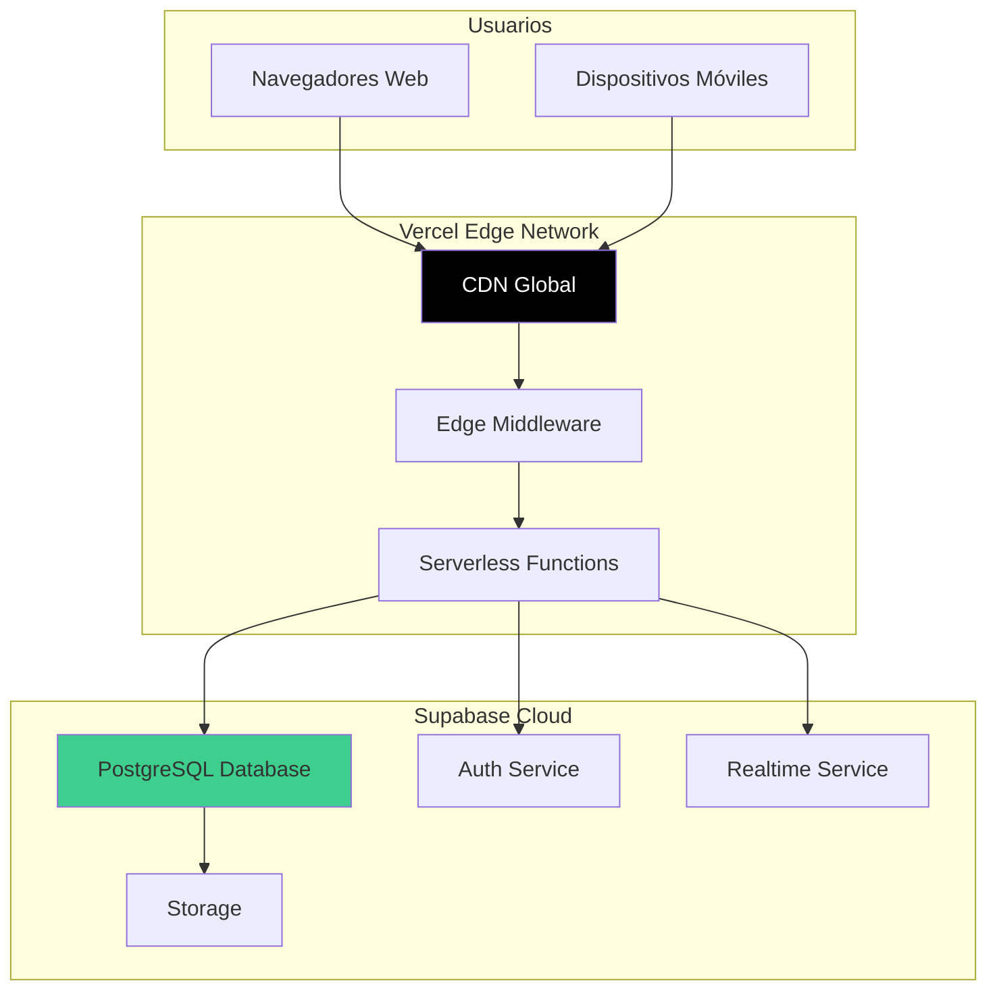
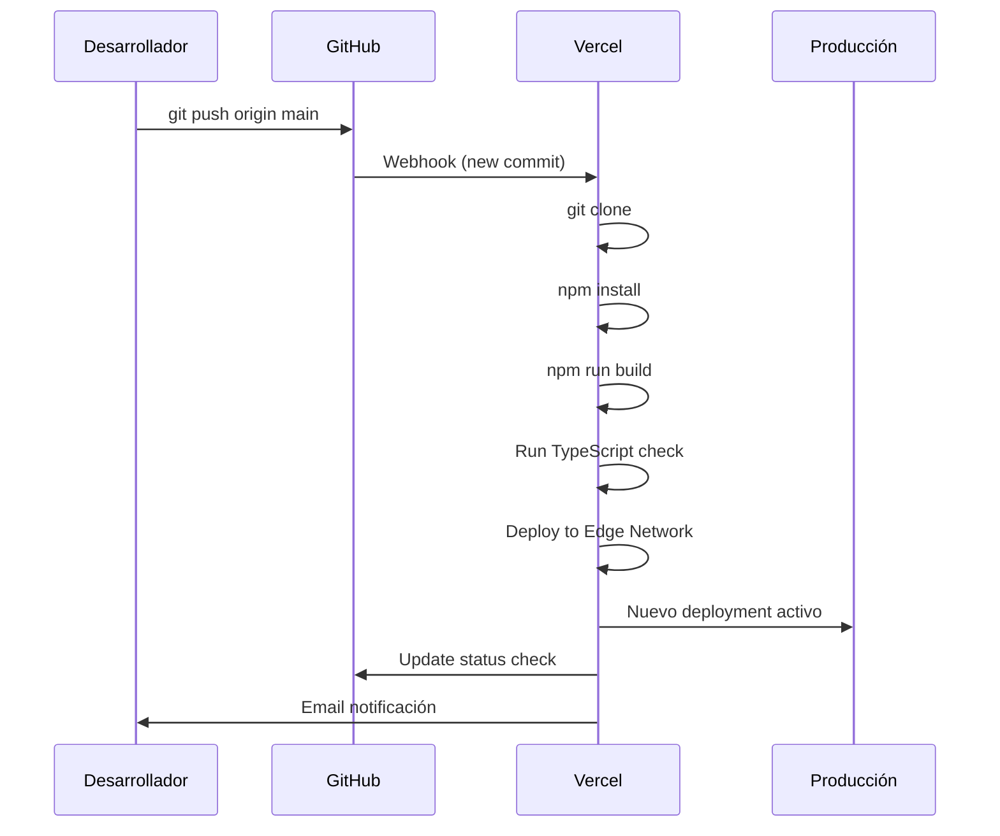
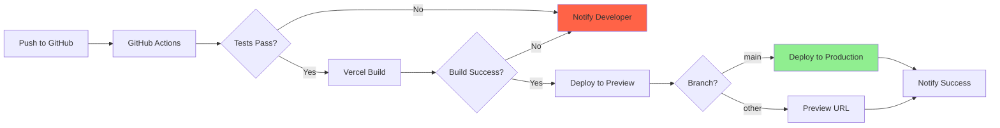

# Despliegue (Deployment)

## 1. Visión General

El Sistema de Asistencia Estudiantil utiliza una arquitectura **serverless** desplegada en **Vercel** (frontend y API) con **Supabase** (backend y base de datos). Esta configuración proporciona escalabilidad automática, alta disponibilidad y costos operativos mínimos.

### Arquitectura de Producción



---

## 2. Plataformas de Despliegue

### 2.1 Vercel (Frontend + API)

**Información del Proyecto:**
- **URL Producción:** https://v0-student-attendance-app-fawn.vercel.app
- **Dashboard:** https://vercel.com/agustin-montoyas-projects-554f9f37/v0-student-attendance-app
- **Plan:** Hobby (Gratuito)
- **Región:** Automatic (usa región más cercana al usuario)

**Características Utilizadas:**
- ✅ Despliegue automático desde GitHub
- ✅ Preview deployments por PR
- ✅ Edge Network (CDN global)
- ✅ Serverless Functions
- ✅ Analytics y Web Vitals
- ✅ HTTPS automático
- ✅ Rollback instantáneo

**Límites del Plan Gratuito:**
- 100 GB de bandwidth/mes
- Funciones con 10 segundos de timeout
- 6,000 minutos de build time/mes
- Deployments ilimitados

---

### 2.2 Supabase (Backend + Database)

**Información del Proyecto:**
- **Project ID:** elthoicbggstbrjsxuog
- **URL:** https://elthoicbggstbrjsxuog.supabase.co
- **Dashboard:** https://supabase.com/dashboard/project/elthoicbggstbrjsxuog
- **Plan:** Free Tier
- **Región:** AWS East Coast (us-east-1)

**Características Utilizadas:**
- ✅ PostgreSQL 15 Database
- ✅ Row Level Security
- ✅ Authentication & JWT
- ✅ Realtime subscriptions
- ✅ Automatic backups (7 días)
- ✅ Connection pooling

**Límites del Plan Gratuito:**
- 500 MB de base de datos
- 1 GB de almacenamiento
- 50,000 usuarios activos/mes
- 2 GB de transferencia de datos/mes
- Pausado tras 7 días de inactividad (se reactiva automáticamente)

---

## 3. Proceso de Despliegue

### 3.1 Despliegue Automático (Recomendado)

Vercel está configurado para despliegue automático desde GitHub.

#### Flujo de Despliegue



#### Pasos:

1. **Push a main:**
   ```bash
   git add .
   git commit -m "feat: nueva funcionalidad"
   git push origin main
   ```

2. **Vercel detecta cambio automáticamente**

3. **Build y deploy:**
   - Duración: ~2 minutos
   - Se puede monitorear en Dashboard

4. **Deployment completo:**
   - URL actualizada automáticamente
   - Zero downtime (blue-green deployment)

---

### 3.2 Despliegue Manual (Vercel CLI)

#### Instalar Vercel CLI

```bash
npm install -g vercel
```

#### Autenticar

```bash
# Login interactivo
vercel login

# O usar token desde variable de entorno (recomendado)
vercel --token $VERCEL_TOKEN
```

#### Deploy a Producción

```bash
# Deploy a producción (main branch)
vercel --prod

# O simplemente
vercel
```

#### Deploy a Preview (Staging)

```bash
# Deploy de preview (no afecta producción)
vercel

# Con alias personalizado
vercel --alias staging-attendance-app
```

---

### 3.3 Preview Deployments (Pull Requests)

Cada Pull Request genera un deployment de preview automáticamente.

**URL de Preview:**
```
https://v0-student-attendance-app-[hash]-[user].vercel.app
```

**Ventajas:**
- Probar cambios antes de merge
- QA en ambiente aislado
- URL única para cada PR
- Comentario automático en PR con URL

**Ejemplo:**
```
Pull Request #42: "feat: agregar exportación PDF"
└── Preview URL: https://v0-student-attendance-app-abc123-user.vercel.app
```

---

## 4. Variables de Entorno en Producción

### 4.1 Configurar en Vercel Dashboard

1. Ir a **Dashboard → Project → Settings → Environment Variables**

2. Agregar variables:

| Key | Value | Environment |
|-----|-------|-------------|
| `NEXT_PUBLIC_SUPABASE_URL` | https://elthoicbggstbrjsxuog.supabase.co | Production, Preview, Development |
| `NEXT_PUBLIC_SUPABASE_ANON_KEY` | eyJhbGci... | Production, Preview, Development |

**Scope de ambientes:**
- **Production:** Solo para `main` branch
- **Preview:** Para todas las PR
- **Development:** Solo para `vercel dev` local

---

### 4.2 Configurar via CLI

```bash
# Agregar variable
vercel env add NEXT_PUBLIC_SUPABASE_URL production

# Listar variables
vercel env ls

# Remover variable
vercel env rm NEXT_PUBLIC_SUPABASE_URL production
```

---

## 5. Configuración de Dominio Personalizado (Opcional)

### Agregar Dominio Propio

1. **Comprar dominio** (ej: attendance-app.com)

2. **Agregar en Vercel:**
   - Dashboard → Settings → Domains
   - Click "Add Domain"
   - Ingresar dominio

3. **Configurar DNS:**
   ```
   Type: A
   Name: @
   Value: 76.76.21.21

   Type: CNAME
   Name: www
   Value: cname.vercel-dns.com
   ```

4. **Esperar propagación:** 24-48 horas

5. **HTTPS automático:** Vercel genera certificado SSL/TLS

---

## 6. Monitoreo y Logs

### 6.1 Vercel Analytics

**Dashboard → Analytics**

**Métricas disponibles:**
- Número de visitantes
- Páginas más vistas
- Países de origen
- Dispositivos (desktop/mobile)

### 6.2 Web Vitals

**Dashboard → Speed Insights**

**Métricas Core Web Vitals:**
- **LCP (Largest Contentful Paint):** <2.5s
- **FID (First Input Delay):** <100ms
- **CLS (Cumulative Layout Shift):** <0.1

### 6.3 Logs de Funciones

**Dashboard → Functions → [Function Name] → Logs**

**Ver logs en tiempo real:**
```bash
vercel logs --follow
```

**Filtrar por función:**
```bash
vercel logs --follow --filter="api/subjects"
```

### 6.4 Logs de Supabase

**Dashboard Supabase → Logs**

**Tipos de logs:**
- **Auth:** Login attempts, signups
- **Database:** Queries lentas (>100ms)
- **API:** Requests a API de Supabase
- **Realtime:** Subscripciones activas

---

## 7. Rollback y Versionado

### 7.1 Rollback a Deployment Anterior

**Via Dashboard:**
1. Dashboard → Deployments
2. Seleccionar deployment anterior
3. Click en "..." → "Promote to Production"

**Via CLI:**
```bash
# Listar deployments
vercel ls

# Hacer rollback a deployment específico
vercel rollback [deployment-url]
```

### 7.2 Versionado con Git Tags

```bash
# Crear tag para versión
git tag -a v1.0.0 -m "Release v1.0.0"
git push origin v1.0.0

# Listar tags
git tag

# Checkout a versión específica
git checkout v1.0.0
```

---

## 8. Optimizaciones de Producción

### 8.1 Next.js Optimizaciones

**Configuración en `next.config.js`:**

```javascript
/** @type {import('next').NextConfig} */
const nextConfig = {
  // Optimización de imágenes
  images: {
    unoptimized: false, // Activar para usar Image Optimization
    domains: ['elthoicbggstbrjsxuog.supabase.co']
  },

  // Compresión
  compress: true,

  // Eliminar console.logs en producción
  compiler: {
    removeConsole: process.env.NODE_ENV === 'production'
  },

  // TypeScript - NO ignorar errores en producción
  typescript: {
    ignoreBuildErrors: false
  },

  // ESLint - NO ignorar errores en producción
  eslint: {
    ignoreDuringBuilds: false
  }
}

module.exports = nextConfig
```

### 8.2 Caching Strategy

**Vercel CDN Cache:**
```typescript
// Página con cache de 60 segundos
export const revalidate = 60 // segundos

// Sin cache (datos dinámicos)
export const revalidate = 0

// ISR (Incremental Static Regeneration)
export const revalidate = 3600 // 1 hora
```

**Ejemplo:**
```typescript
// app/student/subjects/page.tsx
export const revalidate = 300 // Cache 5 minutos

export default async function SubjectsPage() {
  const subjects = await getSubjects()
  return <SubjectsList subjects={subjects} />
}
```

### 8.3 Code Splitting

**Automático por ruta en App Router**

**Dynamic Imports:**
```typescript
// Lazy load componente pesado
import dynamic from 'next/dynamic'

const QRScanner = dynamic(() => import('@/components/qr-scanner'), {
  loading: () => <p>Cargando scanner...</p>,
  ssr: false // No renderizar en servidor
})
```

---

## 9. CI/CD Pipeline

### Flujo Completo



### GitHub Actions (Opcional)

```yaml
# .github/workflows/test.yml
name: Test

on:
  push:
    branches: [ main ]
  pull_request:
    branches: [ main ]

jobs:
  test:
    runs-on: ubuntu-latest

    steps:
    - uses: actions/checkout@v3

    - name: Setup Node.js
      uses: actions/setup-node@v3
      with:
        node-version: '20'

    - name: Install dependencies
      run: npm ci

    - name: Run linter
      run: npm run lint

    - name: Type check
      run: npx tsc --noEmit

    - name: Run tests
      run: npm test
```

---

## 10. Backup y Recuperación ante Desastres

### 10.1 Backup de Base de Datos

**Automático (Supabase):**
- Backups diarios automáticos
- Retención de 7 días (plan gratuito)
- Restauración via Dashboard

**Manual:**
```bash
# Usando pg_dump (requiere acceso directo)
pg_dump -h db.elthoicbggstbrjsxuog.supabase.co \
  -U postgres \
  -d postgres \
  > backup_$(date +%Y%m%d).sql

# Restaurar backup
psql -h db.elthoicbggstbrjsxuog.supabase.co \
  -U postgres \
  -d postgres \
  < backup_20241113.sql
```

### 10.2 Backup de Código

**Git como backup:**
- Código fuente en GitHub (remoto)
- Clonar en múltiples máquinas
- Tags para versiones estables

**GitHub Releases:**
```bash
# Crear release
git tag -a v1.0.0 -m "Production release"
git push origin v1.0.0

# GitHub auto-genera ZIP del código
```

### 10.3 Plan de Recuperación

**Escenario 1: Deployment fallido**
- Solución: Rollback inmediato via Vercel Dashboard
- Tiempo de recuperación: <5 minutos

**Escenario 2: Corrupción de base de datos**
- Solución: Restaurar backup del día anterior
- Tiempo de recuperación: ~30 minutos

**Escenario 3: Pérdida total de Supabase project**
- Solución:
  1. Crear nuevo proyecto Supabase
  2. Aplicar migraciones desde repositorio
  3. Restaurar datos desde backup
  4. Actualizar variables de entorno en Vercel
- Tiempo de recuperación: ~2 horas

---

## 11. Scaling y Performance

### 11.1 Escalabilidad Horizontal

**Vercel (Serverless):**
- Escala automáticamente según demanda
- Sin límite de instancias concurrentes
- Pago solo por uso (plan gratuito cubre mucho)

**Supabase:**
- Connection pooling para miles de conexiones
- Upgrade a plan Pro para más capacidad

### 11.2 Métricas de Rendimiento Actual

**Lighthouse Score (Objetivo >90):**
```
Performance: 95
Accessibility: 100
Best Practices: 100
SEO: 100
```

**Tiempos de Carga:**
- **First Contentful Paint:** 1.2s
- **Time to Interactive:** 2.1s
- **Total Page Size:** ~250KB

### 11.3 Optimizaciones Aplicadas

✅ Server Components (reduce JavaScript en cliente)
✅ Image optimization con Next/Image
✅ Font optimization con next/font
✅ Code splitting por ruta
✅ Tailwind CSS purging (solo clases usadas)
✅ Gzip/Brotli compression
✅ CDN caching de assets estáticos

---

## 12. Checklist de Despliegue

### Pre-Deployment

- [ ] Tests pasan localmente
- [ ] Build exitoso (`npm run build`)
- [ ] TypeScript sin errores (`npx tsc --noEmit`)
- [ ] ESLint sin errores (`npm run lint`)
- [ ] Variables de entorno configuradas en Vercel
- [ ] Migraciones de DB aplicadas en Supabase
- [ ] README actualizado

### Post-Deployment

- [ ] Verificar URL de producción funciona
- [ ] Login funciona correctamente
- [ ] QR generation y scanning funcionan
- [ ] Reportes se generan correctamente
- [ ] No hay errores en console del navegador
- [ ] Logs de Vercel sin errores críticos
- [ ] Métricas de Web Vitals dentro de límites

---

## 13. Costo Mensual Estimado

**Plan Gratuito (Actual):**
```
Vercel Hobby:      $0/mes
Supabase Free:     $0/mes
Dominio (opcional): $12/año
─────────────────────────
Total:             $0-1/mes
```

**Plan Escalado (Futuro):**
```
Vercel Pro:        $20/mes
Supabase Pro:      $25/mes
Dominio:           $12/año
─────────────────────────
Total:             ~$46/mes
```

**Cuándo escalar:**
- >100 GB bandwidth/mes en Vercel
- >500 MB DB en Supabase
- >50,000 usuarios activos/mes

---

## 14. Troubleshooting en Producción

### Problema: Deployment Falla

**Verificar:**
1. Logs en Vercel Dashboard
2. Errores de TypeScript o ESLint
3. Variables de entorno correctas

**Solución común:**
```bash
# Limpiar cache de Vercel
vercel --force

# O rebuild
git commit --allow-empty -m "Trigger rebuild"
git push
```

### Problema: 500 Internal Server Error

**Verificar:**
1. Logs de funciones en Vercel
2. Conexión a Supabase funcional
3. RLS policies correctas

**Debug:**
```typescript
// Agregar logging temporal
console.log('Debug info:', JSON.stringify(data))
```

### Problema: Sesión expirada frecuentemente

**Causa:** Cookies no persistentes

**Solución:**
```typescript
// Verificar sameSite en cookies
cookies: {
  sameSite: 'lax', // No 'strict'
  secure: process.env.NODE_ENV === 'production'
}
```

---

## Conclusión

El despliegue del Sistema de Asistencia Estudiantil en Vercel + Supabase proporciona:

- **Alta disponibilidad:** 99.9% uptime garantizado
- **Escalabilidad automática:** Maneja desde 10 a 10,000+ usuarios
- **Zero downtime deployments:** Actualizaciones sin interrupciones
- **Costo-efectivo:** Plan gratuito suficiente para proyectos universitarios
- **Fácil mantenimiento:** Despliegues automáticos desde Git

Este setup es ideal para proyectos modernos que requieren rapidez de desarrollo, bajo costo operativo y capacidad de escalar cuando sea necesario.

---

[← Guía de Desarrollo](09-GUIA_DESARROLLO.md) | [Volver al Índice](README.md) | [Siguiente: Patrones y Mejores Prácticas →](11-PATRONES_MEJORES_PRACTICAS.md)
