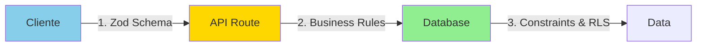

# Patrones y Mejores Prácticas

## 1. Visión General

Este documento detalla los patrones de diseño, convenciones de código y mejores prácticas implementadas en el Sistema de Asistencia Estudiantil para garantizar código mantenible, escalable y de alta calidad.

---

## 2. Patrones de Arquitectura

### 2.1 Server Components First

**Patrón:** Usar Server Components por defecto, Client Components solo cuando sea necesario.

```typescript
// ✅ BUENO: Server Component (por defecto)
// app/teacher/page.tsx
export default async function TeacherDashboard() {
  const supabase = await createClient()
  const { data: subjects } = await supabase
    .from('subjects')
    .select('*')

  return <SubjectsList subjects={subjects} />
}

// ✅ BUENO: Client Component (cuando se necesita interactividad)
// components/subject-card.tsx
'use client'

export function SubjectCard({ subject }) {
  const [isOpen, setIsOpen] = useState(false)

  return (
    <Card>
      <Button onClick={() => setIsOpen(true)}>
        Editar
      </Button>
      {/* ... */}
    </Card>
  )
}
```

**Beneficios:**
- Menos JavaScript enviado al cliente
- Mejor SEO (contenido pre-renderizado)
- Acceso directo a base de datos

---

### 2.2 Repository Pattern (Implicit)

**Patrón:** Encapsular lógica de acceso a datos en servicios específicos.

```typescript
// ❌ MALO: Lógica de DB dispersa
export async function Component() {
  const supabase = await createClient()
  const { data } = await supabase.from('subjects').select('*')
  // Lógica duplicada en múltiples componentes
}

// ✅ BUENO: Servicio centralizado
// lib/services/subject.service.ts
export class SubjectService {
  private static supabase = createClient()

  static async getSubjectsByTeacher(teacherId: string) {
    const { data, error } = await this.supabase
      .from('subjects')
      .select('*, enrollments(count)')
      .eq('teacher_id', teacherId)

    if (error) throw error
    return data
  }

  static async createSubject(data: SubjectInsert) {
    // Validación y lógica de negocio
    const { data: subject, error } = await this.supabase
      .from('subjects')
      .insert(data)
      .select()
      .single()

    if (error) throw error
    return subject
  }
}

// Uso en componente
const subjects = await SubjectService.getSubjectsByTeacher(teacherId)
```

---

### 2.3 Factory Pattern para Clientes Supabase

**Patrón:** Crear clientes Supabase específicos para cada contexto.

```typescript
// lib/supabase/client.ts (Browser)
export function createClient() {
  return createBrowserClient(
    process.env.NEXT_PUBLIC_SUPABASE_URL!,
    process.env.NEXT_PUBLIC_SUPABASE_ANON_KEY!
  )
}

// lib/supabase/server.ts (Server)
export async function createClient() {
  const cookieStore = await cookies()
  return createServerClient(/* ... */)
}

// Uso correcto según contexto
// ✅ En Client Component
'use client'
import { createClient } from '@/lib/supabase/client'

// ✅ En Server Component
import { createClient } from '@/lib/supabase/server'
```

---

### 2.4 Guard Pattern para Protección de Rutas

**Patrón:** Verificar autenticación y autorización en layouts.

```typescript
// app/teacher/layout.tsx
export default async function TeacherLayout({ children }) {
  const supabase = await createClient()

  // Guard 1: Autenticación
  const { data: { user } } = await supabase.auth.getUser()
  if (!user) {
    redirect('/auth/login?role=teacher')
  }

  // Guard 2: Autorización (verificar rol)
  const { data: profile } = await supabase
    .from('profiles')
    .select('role')
    .eq('id', user.id)
    .maybeSingle()

  if (!profile || profile.role !== 'teacher') {
    redirect('/student') // Redirigir a dashboard correcto
  }

  return (
    <div>
      <TeacherNav />
      {children}
    </div>
  )
}
```

---

## 3. Patrones de React

### 3.1 Composition Pattern

**Patrón:** Componer componentes en lugar de herencia.

```typescript
// ✅ BUENO: Composición
interface CardProps {
  children: React.ReactNode
  title?: string
  actions?: React.ReactNode
}

export function Card({ children, title, actions }: CardProps) {
  return (
    <div className="border rounded-lg p-4">
      {title && (
        <div className="flex justify-between items-center mb-4">
          <h3 className="text-lg font-semibold">{title}</h3>
          {actions}
        </div>
      )}
      {children}
    </div>
  )
}

// Uso flexible
<Card title="Materia" actions={<Button>Editar</Button>}>
  <p>{subject.name}</p>
</Card>
```

---

### 3.2 Hooks Personalizados

**Patrón:** Extraer lógica reutilizable a custom hooks.

```typescript
// ✅ BUENO: Custom Hook
// hooks/use-qr-scanner.ts
export function useQRScanner() {
  const [isScanning, setIsScanning] = useState(false)
  const [error, setError] = useState<string | null>(null)
  const videoRef = useRef<HTMLVideoElement>(null)
  const controlsRef = useRef<IScannerControls | null>(null)

  const startScanning = async (onDetect: (qr: string) => void) => {
    try {
      setIsScanning(true)
      setError(null)

      const controls = await QRScanner.initScanner(
        videoRef.current!,
        onDetect,
        (err) => setError(err.message)
      )

      controlsRef.current = controls
    } catch (err) {
      setError(err.message)
    }
  }

  const stopScanning = () => {
    if (controlsRef.current) {
      QRScanner.stopScanner(controlsRef.current)
      controlsRef.current = null
    }
    setIsScanning(false)
  }

  // Cleanup automático
  useEffect(() => {
    return () => stopScanning()
  }, [])

  return {
    isScanning,
    error,
    videoRef,
    startScanning,
    stopScanning
  }
}

// Uso en componente
function QRScannerDialog() {
  const { videoRef, startScanning, stopScanning } = useQRScanner()
  // ...
}
```

---

### 3.3 Error Boundary Pattern

**Patrón:** Capturar errores en componentes de React.

```typescript
// app/error.tsx (App Router error boundary)
'use client'

export default function Error({
  error,
  reset,
}: {
  error: Error & { digest?: string }
  reset: () => void
}) {
  useEffect(() => {
    console.error('Application error:', error)
  }, [error])

  return (
    <div className="flex flex-col items-center justify-center min-h-screen">
      <h2 className="text-2xl font-bold mb-4">
        Algo salió mal
      </h2>
      <p className="text-muted-foreground mb-6">
        {error.message}
      </p>
      <Button onClick={reset}>
        Intentar nuevamente
      </Button>
    </div>
  )
}
```

---

## 4. Patrones de Supabase

### 4.1 Siempre Usar `.maybeSingle()`

**Patrón:** Usar `.maybeSingle()` en lugar de `.single()` para evitar errores.

```typescript
// ❌ MALO: Lanza error si no encuentra
const { data } = await supabase
  .from('profiles')
  .select('*')
  .eq('id', userId)
  .single() // Lanza PGRST116 si no existe

// ✅ BUENO: Retorna null si no encuentra
const { data } = await supabase
  .from('profiles')
  .select('*')
  .eq('id', userId)
  .maybeSingle() // Retorna null sin error

if (!data) {
  // Manejar caso de no encontrado
}
```

---

### 4.2 Cleanup de Suscripciones Realtime

**Patrón:** Siempre limpiar suscripciones en useEffect cleanup.

```typescript
// ✅ BUENO: Con cleanup
useEffect(() => {
  const channel = supabase
    .channel('attendance_updates')
    .on(
      'postgres_changes',
      { event: 'INSERT', schema: 'public', table: 'attendance_records' },
      (payload) => {
        setRecords(prev => [...prev, payload.new])
      }
    )
    .subscribe()

  // ✅ CRUCIAL: Cleanup
  return () => {
    supabase.removeChannel(channel)
  }
}, []) // Empty deps = solo una vez

// ❌ MALO: Sin cleanup (memory leak)
useEffect(() => {
  const channel = supabase.channel('updates').subscribe()
  // Sin cleanup!
}, [])
```

---

### 4.3 Manejo de Errores de Supabase

**Patrón:** Siempre verificar y manejar errores.

```typescript
// ✅ BUENO: Manejo completo de errores
const { data, error } = await supabase
  .from('subjects')
  .insert(subjectData)
  .select()
  .single()

if (error) {
  // Errores específicos
  if (error.code === '23505') {
    throw new Error('Ya existe una materia con ese código')
  }

  if (error.code === '23503') {
    throw new Error('Referencia inválida')
  }

  // Error genérico
  throw new Error(`Error de base de datos: ${error.message}`)
}

// Usar data con seguridad
console.log(data.name)
```

---

## 5. Patrones de TypeScript

### 5.1 Type-First Development

**Patrón:** Definir tipos antes de implementar.

```typescript
// 1. Definir tipos primero
interface AttendanceRecord {
  id: string
  session_id: string
  student_id: string
  subject_id: string
  scanned_at: string
}

type AttendanceRecordInsert = Omit<AttendanceRecord, 'id' | 'scanned_at'>

// 2. Implementar funciones con tipos
async function recordAttendance(
  data: AttendanceRecordInsert
): Promise<AttendanceRecord> {
  // TypeScript valida en tiempo de compilación
}
```

---

### 5.2 Discriminated Unions para Estados

**Patrón:** Usar uniones discriminadas para estados mutuamente excluyentes.

```typescript
// ✅ BUENO: Estado con discriminated union
type LoadingState =
  | { status: 'idle' }
  | { status: 'loading' }
  | { status: 'success'; data: Subject[] }
  | { status: 'error'; error: string }

const [state, setState] = useState<LoadingState>({ status: 'idle' })

// TypeScript infiere tipos automáticamente
if (state.status === 'success') {
  console.log(state.data) // Type: Subject[]
}

if (state.status === 'error') {
  console.log(state.error) // Type: string
}

// ❌ MALO: Estados separados (pueden ser inconsistentes)
const [loading, setLoading] = useState(false)
const [data, setData] = useState<Subject[]>([])
const [error, setError] = useState<string | null>(null)
// Problema: loading=true y data=[] al mismo tiempo (inconsistente)
```

---

### 5.3 Utility Types

**Patrón:** Usar utility types de TypeScript para transformar tipos.

```typescript
// Tipos base
interface Subject {
  id: string
  name: string
  code: string
  teacher_id: string
  created_at: string
}

// Tipos derivados
type SubjectInsert = Omit<Subject, 'id' | 'created_at'>
type SubjectUpdate = Partial<SubjectInsert>
type SubjectId = Pick<Subject, 'id'>
type ReadonlySubject = Readonly<Subject>

// Uso
function createSubject(data: SubjectInsert) { /* ... */ }
function updateSubject(id: string, data: SubjectUpdate) { /* ... */ }
```

---

## 6. Patrones de Validación

### 6.1 Schema-Based Validation con Zod

**Patrón:** Definir schemas Zod reutilizables.

```typescript
// lib/validations/subject.schema.ts
import { z } from 'zod'

export const subjectSchema = z.object({
  name: z.string().min(3, 'Nombre debe tener al menos 3 caracteres'),
  code: z.string().regex(/^[A-Z0-9]+$/, 'Código debe ser alfanumérico en mayúsculas'),
  schedule: z.string().optional(),
  description: z.string().optional()
})

export type SubjectFormData = z.infer<typeof subjectSchema>

// Uso en formulario (client)
const form = useForm<SubjectFormData>({
  resolver: zodResolver(subjectSchema)
})

// Uso en API (server)
export async function POST(request: Request) {
  const body = await request.json()
  const result = subjectSchema.safeParse(body)

  if (!result.success) {
    return Response.json(
      { error: 'Validación fallida', details: result.error },
      { status: 400 }
    )
  }

  // Usar result.data con seguridad
}
```

---

### 6.2 Validación Multi-Capa

**Patrón:** Validar en cliente, API y base de datos.



---

## 7. Patrones de Manejo de Estado

### 7.1 Server State vs Client State

**Patrón:** Diferenciar claramente entre estado del servidor y cliente.

```typescript
// Server State (de la base de datos)
// ✅ Fetch en Server Component, pasar como props
export default async function Page() {
  const subjects = await getSubjects() // Server state
  return <SubjectsList subjects={subjects} />
}

// Client State (UI local)
// ✅ Manejar en Client Component con useState
'use client'
export function SubjectsList({ subjects }) {
  const [filter, setFilter] = useState('') // Client state
  const [selectedId, setSelectedId] = useState<string | null>(null)

  const filtered = subjects.filter(s => s.name.includes(filter))

  return (
    <div>
      <input value={filter} onChange={e => setFilter(e.target.value)} />
      {filtered.map(subject => (
        <SubjectCard
          key={subject.id}
          subject={subject}
          isSelected={subject.id === selectedId}
          onSelect={() => setSelectedId(subject.id)}
        />
      ))}
    </div>
  )
}
```

---

### 7.2 Optimistic Updates

**Patrón:** Actualizar UI inmediatamente, revertir si falla.

```typescript
async function enrollInSubject(subjectId: string) {
  // 1. Actualizar UI optimísticamente
  setEnrolled(true)

  try {
    // 2. Llamar a API
    await fetch('/api/enrollments', {
      method: 'POST',
      body: JSON.stringify({ subject_id: subjectId })
    })

    // 3. Refresh server state
    router.refresh()

  } catch (error) {
    // 4. Revertir si falla
    setEnrolled(false)
    toast({ title: 'Error al inscribirse', variant: 'destructive' })
  }
}
```

---

## 8. Patrones de Performance

### 8.1 Lazy Loading de Componentes

**Patrón:** Cargar componentes pesados solo cuando se necesiten.

```typescript
import dynamic from 'next/dynamic'

// ✅ Lazy load componente de QR scanner
const QRScanner = dynamic(
  () => import('@/components/qr-scanner-dialog'),
  {
    loading: () => <Skeleton className="w-full h-64" />,
    ssr: false // No renderizar en servidor (requiere cámara)
  }
)

export function StudentDashboard() {
  const [scannerOpen, setScannerOpen] = useState(false)

  return (
    <div>
      <Button onClick={() => setScannerOpen(true)}>
        Escanear QR
      </Button>

      {/* Solo carga cuando scannerOpen es true */}
      {scannerOpen && (
        <QRScanner
          open={scannerOpen}
          onOpenChange={setScannerOpen}
        />
      )}
    </div>
  )
}
```

---

### 8.2 Memoización Selectiva

**Patrón:** Usar memoización solo cuando sea necesario.

```typescript
// ✅ Memoizar cálculos costosos
const expensiveValue = useMemo(() => {
  return subjects.reduce((acc, subject) => {
    // Cálculo complejo
    return acc + calculateComplexMetric(subject)
  }, 0)
}, [subjects]) // Solo recalcula cuando subjects cambia

// ✅ Memoizar callbacks que se pasan a child components
const handleSubjectSelect = useCallback((id: string) => {
  setSelectedId(id)
  // Lógica adicional
}, []) // Sin dependencias = función estable

// ❌ NO memoizar valores simples
const filteredSubjects = useMemo(
  () => subjects.filter(s => s.name.includes(filter)),
  [subjects, filter]
)
// Innecesario - filter es rápido, React Compiler lo optimiza
```

---

### 8.3 Debouncing de Inputs

**Patrón:** Esperar antes de ejecutar operaciones costosas.

```typescript
import { useDeferredValue } from 'react'

function SearchSubjects() {
  const [query, setQuery] = useState('')

  // ✅ Defer value para evitar re-renders costosos
  const deferredQuery = useDeferredValue(query)

  // Filtrar con valor diferido
  const results = subjects.filter(s =>
    s.name.toLowerCase().includes(deferredQuery.toLowerCase())
  )

  return (
    <div>
      <input
        value={query}
        onChange={e => setQuery(e.target.value)}
        placeholder="Buscar materias..."
      />
      <ResultsList results={results} />
    </div>
  )
}
```

---

## 9. Patrones de Seguridad

### 9.1 Sanitización de Inputs

**Patrón:** Nunca confiar en input del usuario.

```typescript
// ✅ BUENO: Validar y sanitizar
function createSubject(input: unknown) {
  // 1. Validar estructura
  const result = subjectSchema.safeParse(input)
  if (!result.success) {
    throw new Error('Input inválido')
  }

  // 2. Sanitizar strings (remover HTML, etc.)
  const sanitized = {
    ...result.data,
    name: result.data.name.trim(),
    code: result.data.code.toUpperCase().trim()
  }

  // 3. Usar en query parametrizada (Supabase lo hace automáticamente)
  return supabase.from('subjects').insert(sanitized)
}

// ❌ MALO: Usar input directamente
function createSubject(input: any) {
  return supabase.from('subjects').insert(input) // ¡Peligroso!
}
```

---

### 9.2 Verificación de Permisos en Cada Request

**Patrón:** Nunca asumir que el cliente envía datos válidos.

```typescript
// API Route
export async function DELETE(
  request: Request,
  { params }: { params: { id: string } }
) {
  const supabase = await createClient()

  // 1. Verificar autenticación
  const { data: { user } } = await supabase.auth.getUser()
  if (!user) {
    return Response.json({ error: 'No autorizado' }, { status: 401 })
  }

  // 2. Verificar que la materia pertenece al usuario
  const { data: subject } = await supabase
    .from('subjects')
    .select('teacher_id')
    .eq('id', params.id)
    .maybeSingle()

  if (!subject || subject.teacher_id !== user.id) {
    return Response.json({ error: 'Prohibido' }, { status: 403 })
  }

  // 3. Ejecutar operación
  await supabase.from('subjects').delete().eq('id', params.id)

  return Response.json({ message: 'Eliminado' })
}
```

---

## 10. Patrones de Testing

### 10.1 Arrange-Act-Assert (AAA)

**Patrón:** Estructura clara en tests.

```typescript
import { QRService } from '@/lib/qr/generator'

describe('QRService', () => {
  test('debe generar código con formato correcto', () => {
    // Arrange (Preparar)
    const subjectId = 'abc-123-def-456'

    // Act (Actuar)
    const qrCode = QRService.generateQRCode(subjectId)

    // Assert (Afirmar)
    expect(qrCode).toMatch(/^abc-123-def-456-\d+-[a-z0-9]+$/)
    expect(qrCode.split('-')).toHaveLength(7) // UUID tiene 5 segmentos
  })
})
```

---

### 10.2 Test de Componentes

**Patrón:** Testear comportamiento, no implementación.

```typescript
import { render, screen, fireEvent } from '@testing/library/react'
import { SubjectCard } from '@/components/subject-card'

test('debe llamar onEdit cuando se hace click en editar', () => {
  // Arrange
  const subject = { id: '1', name: 'Matemáticas', code: 'MAT101' }
  const handleEdit = jest.fn()

  // Act
  render(<SubjectCard subject={subject} onEdit={handleEdit} />)
  const editButton = screen.getByRole('button', { name: /editar/i })
  fireEvent.click(editButton)

  // Assert
  expect(handleEdit).toHaveBeenCalledWith('1')
})
```

---

## 11. Convenciones de Código

### 11.1 Nomenclatura

```typescript
// Variables y funciones: camelCase
const userName = 'John'
function getUserById(id: string) {}

// Componentes y clases: PascalCase
class SubjectService {}
function SubjectCard() {}

// Constantes: UPPER_SNAKE_CASE
const MAX_UPLOAD_SIZE = 5 * 1024 * 1024

// Archivos:
// - Componentes: kebab-case (subject-card.tsx)
// - Utilidades: kebab-case (qr-generator.ts)
// - Tipos: kebab-case (types.ts)

// Booleanos: prefijo is/has/should
const isLoading = true
const hasPermission = false
const shouldRender = true
```

---

### 11.2 Organización de Imports

```typescript
// 1. External libraries
import React, { useState, useEffect } from 'react'
import { useRouter } from 'next/navigation'

// 2. Internal modules
import { createClient } from '@/lib/supabase/client'
import { SubjectService } from '@/lib/services/subject.service'

// 3. Components
import { Button } from '@/components/ui/button'
import { SubjectCard } from '@/components/subject-card'

// 4. Types
import type { Subject } from '@/lib/types'

// 5. Styles (si aplica)
import './styles.css'
```

---

### 11.3 Comentarios

```typescript
// ✅ BUENO: Comentarios que explican "por qué", no "qué"
// Usamos .stop() en lugar de .reset() porque .reset()
// no libera la cámara correctamente en iOS Safari
controls.stop()

// ✅ BUENO: JSDoc para funciones públicas
/**
 * Genera un código QR único para sesión de asistencia
 * @param subjectId - ID de la materia
 * @returns Código QR en formato: {subjectId}-{timestamp}-{random}
 */
export function generateQRCode(subjectId: string): string {
  // ...
}

// ❌ MALO: Comentarios obvios
// Incrementar contador en 1
counter++
```

---

## 12. Checklist de Mejores Prácticas

### Código General
- [ ] TypeScript strict mode habilitado
- [ ] No usar `any` (usar `unknown` o tipos específicos)
- [ ] Manejar todos los casos de error
- [ ] Limpiar recursos (listeners, subscriptions, timers)
- [ ] Validar inputs en cliente y servidor

### React/Next.js
- [ ] Usar Server Components por defecto
- [ ] Client Components solo para interactividad
- [ ] Cleanup en todos los useEffect
- [ ] Keys únicas en listas
- [ ] Props tipadas con TypeScript

### Supabase
- [ ] Usar `.maybeSingle()` en lugar de `.single()`
- [ ] Verificar errores en todas las queries
- [ ] RLS habilitado en todas las tablas
- [ ] Cleanup de subscripciones Realtime

### Seguridad
- [ ] Validación en múltiples capas
- [ ] Nunca confiar en input del cliente
- [ ] Verificar permisos en cada request
- [ ] Secrets en variables de entorno
- [ ] HTTPS en producción

### Performance
- [ ] Lazy load componentes pesados
- [ ] Optimizar imágenes con next/image
- [ ] Code splitting por ruta
- [ ] Memoización selectiva (no prematura)

---

## Conclusión

Las mejores prácticas y patrones implementados en el Sistema de Asistencia Estudiantil garantizan:

- **Código Mantenible:** Fácil de entender y modificar
- **Escalabilidad:** Preparado para crecer
- **Seguridad:** Múltiples capas de protección
- **Performance:** Optimizado para rapidez
- **Calidad:** Testing y validación en todos los niveles

Estos patrones no son reglas absolutas, sino guías que han demostrado funcionar bien en este proyecto. Adapta según las necesidades específicas de tu caso de uso.

---

[← Deployment](10-DEPLOYMENT.md) | [Volver al Índice](README.md)
